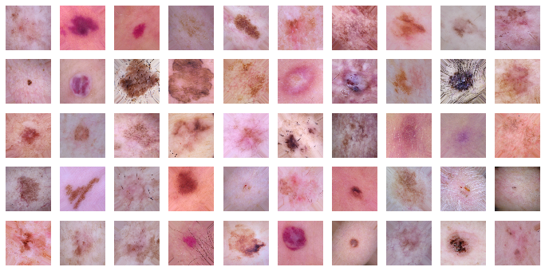

```python
import pandas as pd
import numpy as np

import tensorflow as tf
from tensorflow.keras.layers import Dense, Dropout
from tensorflow.keras.optimizers import Adam
from tensorflow.keras.metrics import categorical_crossentropy
from tensorflow.keras.preprocessing.image import ImageDataGenerator
from tensorflow.keras.models import Model
from tensorflow.keras.callbacks import EarlyStopping, ReduceLROnPlateau, ModelCheckpoint

import os
from glob import glob
import copy

from sklearn.metrics import confusion_matrix
from sklearn.model_selection import train_test_split
import itertools
import shutil
import matplotlib.pyplot as plt
```


```python
%matplotlib inline
%load_ext tensorboard
```

    The tensorboard extension is already loaded. To reload it, use:
      %reload_ext tensorboard
    

### Create Train and Val Sets


```python
df = pd.read_csv('../data/HAM10000_balanced.csv')
df.head()
```


<div>
<style scoped>
    .dataframe tbody tr th:only-of-type {
        vertical-align: middle;
    }

    .dataframe tbody tr th {
        vertical-align: top;
    }

    .dataframe thead th {
        text-align: right;
    }
</style>
<table border="1" class="dataframe">
  <thead>
    <tr style="text-align: right;">
      <th></th>
      <th>Unnamed: 0</th>
      <th>lesion_id</th>
      <th>image_id</th>
      <th>dx</th>
      <th>dx_type</th>
      <th>age</th>
      <th>sex</th>
      <th>localization</th>
      <th>cell_type</th>
      <th>binary_target</th>
      <th>cat_target</th>
    </tr>
  </thead>
  <tbody>
    <tr>
      <th>0</th>
      <td>6</td>
      <td>HAM_0002761</td>
      <td>ISIC_0029176</td>
      <td>bkl</td>
      <td>histo</td>
      <td>60.0</td>
      <td>male</td>
      <td>face</td>
      <td>Benign keratosis-like lesions</td>
      <td>-1</td>
      <td>Non-Melanoma</td>
    </tr>
    <tr>
      <th>1</th>
      <td>11</td>
      <td>HAM_0004234</td>
      <td>ISIC_0029396</td>
      <td>bkl</td>
      <td>histo</td>
      <td>85.0</td>
      <td>female</td>
      <td>chest</td>
      <td>Benign keratosis-like lesions</td>
      <td>-1</td>
      <td>Non-Melanoma</td>
    </tr>
    <tr>
      <th>2</th>
      <td>15</td>
      <td>HAM_0007207</td>
      <td>ISIC_0031326</td>
      <td>bkl</td>
      <td>histo</td>
      <td>65.0</td>
      <td>male</td>
      <td>back</td>
      <td>Benign keratosis-like lesions</td>
      <td>-1</td>
      <td>Non-Melanoma</td>
    </tr>
    <tr>
      <th>3</th>
      <td>15</td>
      <td>HAM_0007207</td>
      <td>ISIC_0031326</td>
      <td>bkl</td>
      <td>histo</td>
      <td>65.0</td>
      <td>male</td>
      <td>back</td>
      <td>Benign keratosis-like lesions</td>
      <td>-1</td>
      <td>Non-Melanoma</td>
    </tr>
    <tr>
      <th>4</th>
      <td>16</td>
      <td>HAM_0001601</td>
      <td>ISIC_0025915</td>
      <td>bkl</td>
      <td>histo</td>
      <td>75.0</td>
      <td>male</td>
      <td>upper extremity</td>
      <td>Benign keratosis-like lesions</td>
      <td>-1</td>
      <td>Non-Melanoma</td>
    </tr>
  </tbody>
</table>
</div>


```python
imageid_path = {os.path.splitext(os.path.basename(x))[0]: x 
                for x in glob(os.path.join('..\\data\\HAM10000', '*.jpg'))}
```


```python
df['path'] = df['image_id'].map(imageid_path.get)
```

### Create a stratified val set


```python
# now we create a val set using df because we are sure that none of these images
# have augmented duplicates in the train set
y = df['cat_target']

_, df_val = train_test_split(df, test_size=0.1, random_state=64, stratify=y)

df_val.shape
```


    (223, 12)


```python
df_val['cat_target'].value_counts()
```


    Melanoma        112
    Non-Melanoma    111
    Name: cat_target, dtype: int64


### Create a train set that excludes images that are in the val set


```python
# This set will be df_data excluding all rows that are in the val set

# This function identifies if an image is part of the train
# or val set.
def identify_val_rows(x):
    # create a list of all the lesion_id's in the val set
    val_list = list(df_val['image_id'])
    
    if str(x) in val_list:
        return 'val'
    else:
        return 'train'

# identify train and val rows

# create a new colum that is a copy of the image_id column
df['train_or_val'] = df['image_id']
# apply the function to this new column
df['train_or_val'] = df['train_or_val'].apply(identify_val_rows)
   
# filter out train rows
df_train = df[df['train_or_val'] == 'train']


print(len(df_train))
print(len(df_val))
```

    1969
    223
    


```python
df_train['cat_target'].value_counts()
```


    Melanoma        1001
    Non-Melanoma     968
    Name: cat_target, dtype: int64


```python
df_val['cat_target'].value_counts()
```


    Melanoma        112
    Non-Melanoma    111
    Name: cat_target, dtype: int64


```python
df_train[df_train['cat_target']=='Melanoma']['path']
```


    329     ..\data\HAM10000\ISIC_0025964.jpg
    330     ..\data\HAM10000\ISIC_0030623.jpg
    331     ..\data\HAM10000\ISIC_0027190.jpg
    332     ..\data\HAM10000\ISIC_0031023.jpg
    333     ..\data\HAM10000\ISIC_0028086.jpg
                          ...                
    1437    ..\data\HAM10000\ISIC_0025611.jpg
    1919    ..\data\HAM10000\ISIC_0032985.jpg
    1974    ..\data\HAM10000\ISIC_0032936.jpg
    1975    ..\data\HAM10000\ISIC_0033232.jpg
    2225    ..\data\HAM10000\ISIC_0032258.jpg
    Name: path, Length: 1001, dtype: object


### Copy the train images  into aug_dir


```python
class_list = ['Melanoma', 'Non-Melanoma']
for item in class_list:
    img_class = item
    df_item = df_train[df_train['cat_target']==item]
    
    datagen = ImageDataGenerator(
        rotation_range=180,
        horizontal_flip=True,
        vertical_flip=True,
        fill_mode='nearest')

    batch_size = 50
    
    save_dir = '../data/aug_dir/' + item
    
    aug_datagen = datagen.flow_from_dataframe(
        df_item,
        x_col='path',
        y_col='binary_target',
        class_mode='raw',
        save_to_dir=save_dir,
        save_format='jpg',
        target_size=(224,224),
        batch_size=batch_size)
    
    num_aug_images_wanted = 5000
    num_files = len(df_item)
    num_batches = int(np.ceil((num_aug_images_wanted-num_files)/batch_size))
    
    for i in range(0, num_batches):
        imgs, labels = next(aug_datagen)
```

    Found 1001 validated image filenames.
    Found 968 validated image filenames.
    

### Visualize 50 augmented images


```python
# plots images with labels within jupyter notebook
# source: https://github.com/smileservices/keras_utils/blob/master/utils.py

def plots(ims, figsize=(12,6), rows=5, interp=False, titles=None): # 12,6
    if type(ims[0]) is np.ndarray:
        ims = np.array(ims).astype(np.uint8)
        if (ims.shape[-1] != 3):
            ims = ims.transpose((0,2,3,1))
    f = plt.figure(figsize=figsize)
    cols = len(ims)//rows if len(ims) % 2 == 0 else len(ims)//rows + 1
    for i in range(len(ims)):
        sp = f.add_subplot(rows, cols, i+1)
        sp.axis('Off')
        if titles is not None:
            sp.set_title(titles[i], fontsize=16)
        plt.imshow(ims[i], interpolation=None if interp else 'none')
        
plots(imgs, titles=None) # titles=labels will display the image labels
```





### Move train set into val_dir


```python
class_list = ['Melanoma', 'Non-Melanoma']
for item in class_list:
    img_class = item
    df_item = df_val[df_val['cat_target']==item]
    
    datagen = ImageDataGenerator()

    batch_size = len(df_item)
    
    save_dir = '../data/val_dir/' + item
    
    aug_datagen = datagen.flow_from_dataframe(
        df_item,
        x_col='path',
        y_col='binary_target',
        class_mode='raw',
        save_to_dir=save_dir,
        save_format='jpg',
        target_size=(224,224),
        batch_size=batch_size)

    imgs, labels = next(aug_datagen)
```

    Found 112 validated image filenames.
    Found 111 validated image filenames.
    


```python
# End of Data Preparation
### ===================================================================================== ###
```


```python

```
