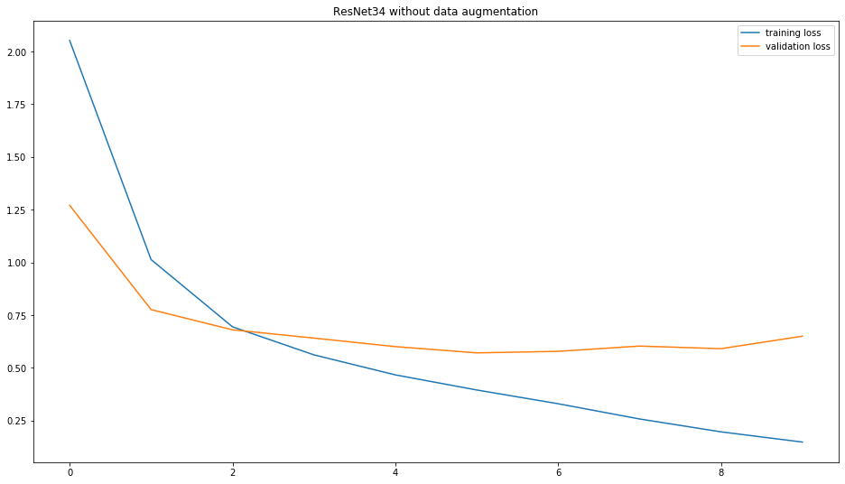
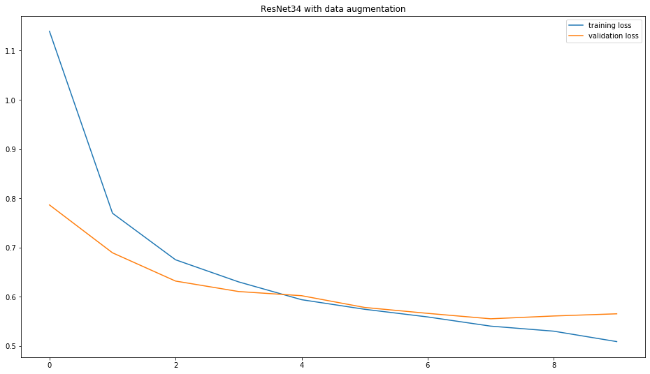
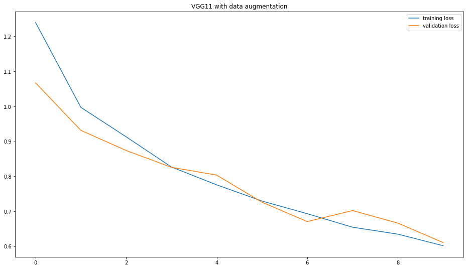

```python
import torch
import torch.nn as nn
from torch.utils import data
from torchvision import transforms as trf
from torchvision import models
import numpy as np
import pandas as pd
import matplotlib.pyplot as plt
import matplotlib.image as mpimg
from sklearn.model_selection import train_test_split
from sklearn.metrics import confusion_matrix, accuracy_score, f1_score, recall_score, precision_score, roc_auc_score, classification_report
from PIL import Image
import os
from glob import glob
import time
import copy
```


```python
np.random.seed(32)
torch.manual_seed(42)
```


    <torch._C.Generator at 0x1a8845473d0>


```python
torch.backends.cudnn.benchmark = True
torch.backends.cudnn.enabled = True
```


```python
CUDA = torch.cuda.is_available()
DEVICE = torch.device("cuda:0" if CUDA else "cpu")
```


```python
df = pd.read_csv('../data/HAM10000_metadata.csv')
df.head()
```


<div>
<style scoped>
    .dataframe tbody tr th:only-of-type {
        vertical-align: middle;
    }

    .dataframe tbody tr th {
        vertical-align: top;
    }

    .dataframe thead th {
        text-align: right;
    }
</style>
<table border="1" class="dataframe">
  <thead>
    <tr style="text-align: right;">
      <th></th>
      <th>lesion_id</th>
      <th>image_id</th>
      <th>dx</th>
      <th>dx_type</th>
      <th>age</th>
      <th>sex</th>
      <th>localization</th>
    </tr>
  </thead>
  <tbody>
    <tr>
      <th>0</th>
      <td>HAM_0000118</td>
      <td>ISIC_0027419</td>
      <td>bkl</td>
      <td>histo</td>
      <td>80.0</td>
      <td>male</td>
      <td>scalp</td>
    </tr>
    <tr>
      <th>1</th>
      <td>HAM_0000118</td>
      <td>ISIC_0025030</td>
      <td>bkl</td>
      <td>histo</td>
      <td>80.0</td>
      <td>male</td>
      <td>scalp</td>
    </tr>
    <tr>
      <th>2</th>
      <td>HAM_0002730</td>
      <td>ISIC_0026769</td>
      <td>bkl</td>
      <td>histo</td>
      <td>80.0</td>
      <td>male</td>
      <td>scalp</td>
    </tr>
    <tr>
      <th>3</th>
      <td>HAM_0002730</td>
      <td>ISIC_0025661</td>
      <td>bkl</td>
      <td>histo</td>
      <td>80.0</td>
      <td>male</td>
      <td>scalp</td>
    </tr>
    <tr>
      <th>4</th>
      <td>HAM_0001466</td>
      <td>ISIC_0031633</td>
      <td>bkl</td>
      <td>histo</td>
      <td>75.0</td>
      <td>male</td>
      <td>ear</td>
    </tr>
  </tbody>
</table>
</div>


```python
lesion_type = {
    'nv': 'Melanocytic nevi',
    'mel': 'Melanoma',
    'bkl': 'Benign keratosis-like lesions ',
    'bcc': 'Basal cell carcinoma',
    'akiec': 'Actinic keratoses',
    'vasc': 'Vascular lesions',
    'df': 'Dermatofibroma'
}

imageid_path = {os.path.splitext(os.path.basename(x))[0]: x
                for x in glob(os.path.join("..\\data", '*', '*.jpg'))}
```


```python
df['path'] = df['image_id'].map(imageid_path.get)
df['cell_type'] = df['dx'].map(lesion_type.get)
df['target'] = pd.Categorical(df['cell_type']).codes
```


```python
df['cell_type'].value_counts()
```


    Melanocytic nevi                  6705
    Melanoma                          1113
    Benign keratosis-like lesions     1099
    Basal cell carcinoma               514
    Actinic keratoses                  327
    Vascular lesions                   142
    Dermatofibroma                     115
    Name: cell_type, dtype: int64


```python
df['target'].value_counts()
```


    4    6705
    5    1113
    2    1099
    1     514
    0     327
    6     142
    3     115
    Name: target, dtype: int64


```python
df.head()
```


<div>
<style scoped>
    .dataframe tbody tr th:only-of-type {
        vertical-align: middle;
    }

    .dataframe tbody tr th {
        vertical-align: top;
    }

    .dataframe thead th {
        text-align: right;
    }
</style>
<table border="1" class="dataframe">
  <thead>
    <tr style="text-align: right;">
      <th></th>
      <th>lesion_id</th>
      <th>image_id</th>
      <th>dx</th>
      <th>dx_type</th>
      <th>age</th>
      <th>sex</th>
      <th>localization</th>
      <th>path</th>
      <th>cell_type</th>
      <th>target</th>
    </tr>
  </thead>
  <tbody>
    <tr>
      <th>0</th>
      <td>HAM_0000118</td>
      <td>ISIC_0027419</td>
      <td>bkl</td>
      <td>histo</td>
      <td>80.0</td>
      <td>male</td>
      <td>scalp</td>
      <td>..\data\HAM10000\ISIC_0027419.jpg</td>
      <td>Benign keratosis-like lesions</td>
      <td>2</td>
    </tr>
    <tr>
      <th>1</th>
      <td>HAM_0000118</td>
      <td>ISIC_0025030</td>
      <td>bkl</td>
      <td>histo</td>
      <td>80.0</td>
      <td>male</td>
      <td>scalp</td>
      <td>..\data\HAM10000\ISIC_0025030.jpg</td>
      <td>Benign keratosis-like lesions</td>
      <td>2</td>
    </tr>
    <tr>
      <th>2</th>
      <td>HAM_0002730</td>
      <td>ISIC_0026769</td>
      <td>bkl</td>
      <td>histo</td>
      <td>80.0</td>
      <td>male</td>
      <td>scalp</td>
      <td>..\data\HAM10000\ISIC_0026769.jpg</td>
      <td>Benign keratosis-like lesions</td>
      <td>2</td>
    </tr>
    <tr>
      <th>3</th>
      <td>HAM_0002730</td>
      <td>ISIC_0025661</td>
      <td>bkl</td>
      <td>histo</td>
      <td>80.0</td>
      <td>male</td>
      <td>scalp</td>
      <td>..\data\HAM10000\ISIC_0025661.jpg</td>
      <td>Benign keratosis-like lesions</td>
      <td>2</td>
    </tr>
    <tr>
      <th>4</th>
      <td>HAM_0001466</td>
      <td>ISIC_0031633</td>
      <td>bkl</td>
      <td>histo</td>
      <td>75.0</td>
      <td>male</td>
      <td>ear</td>
      <td>..\data\HAM10000\ISIC_0031633.jpg</td>
      <td>Benign keratosis-like lesions</td>
      <td>2</td>
    </tr>
  </tbody>
</table>
</div>


```python
n_samples = 5
fig, m_axs = plt.subplots(7, n_samples, figsize = (4*n_samples, 3*7))
for n_axs, (type_name, type_rows) in zip(m_axs, df.sort_values(['cell_type']).groupby('cell_type')):
    n_axs[0].set_title(type_name)
    for c_ax, (_, c_row) in zip(n_axs, type_rows.sample(n_samples, random_state=128).iterrows()):
        img = mpimg.imread(c_row['path'])
        c_ax.imshow(img)
        c_ax.axis('off')
fig.savefig('./output/category_samples.png', dpi=300)
fig.show()
```

    C:\Users\tomoto\Anaconda3\envs\torch\lib\site-packages\ipykernel_launcher.py:10: UserWarning: Matplotlib is currently using module://ipykernel.pylab.backend_inline, which is a non-GUI backend, so cannot show the figure.
      # Remove the CWD from sys.path while we load stuff.
    


```python
class SkinData(data.Dataset):
    def __init__(self, df, transform=None):
        """Initialization"""
        self.df = df
        self.transform = transform
        
    def __len__(self):
        """Denotes the total number of samples"""
        return len(self.df)
    
    def __getitem__(self, index):
        """Generates one sample of data"""
        # Load data and get label
        X = Image.open(self.df['path'][index]).resize((64, 64))
        y = torch.tensor(int(self.df['target'][index]))
        
        if self.transform:
            X = self.transform(X)
        
        return X, y
```

## Data Perparation


```python
train, test = train_test_split(df, test_size=0.1)
```


```python
validation, test = train_test_split(test, test_size=0.5)
```


```python
train = train.reset_index()
validation = validation.reset_index()
test = test.reset_index()
```

## Train Model


```python
def train_model(name, model, data_gen, val_gen, optimizer, criterion, num_epochs=20):
    since = time.time()
    best_weights = copy.deepcopy(model.state_dict())
    fpath = '../model/'
    trainings_error = []
    validation_error = []

    for epoch in range(num_epochs):
        if(epoch%5==0):
            print(f'Saving model...')
            torch.save(model.state_dict(), f'{fpath}_{name}_{epoch}_{time.time()}__.pth')
        print(f'Epoch {epoch} / {num_epochs-1}')
        print('--' * 4)
        trainings_err_tmp = []
        model.train()
        for data, label in data_gen:
            data_gpu = data.to(DEVICE)
            label_gpu = label.to(DEVICE)
            output = model(data_gpu)
            err = criterion(output, label_gpu)
            err.backward()
            optimizer.step()
            trainings_err_tmp.append(err.item())
        mean_trainings_error = np.mean(trainings_err_tmp)
        trainings_error.append(mean_trainings_error)
        print('trainings error:', mean_trainings_error)
            
        with torch.set_grad_enabled(False):
            val_err_tmp = []
            count_val = 0
            model.eval()
            for data, label in val_gen:
                data_gpu = data.to(DEVICE)
                label_gpu = label.to(DEVICE)
                output = model(data_gpu)
                err = criterion(output, label_gpu)
                val_err_tmp.append(err.item())
            mean_val_error = np.mean(val_err_tmp)
            validation_error.append(mean_val_error)
            print('validation error:', mean_val_error)
    del data_gpu
    del label_gpu
    time_since = time.time() - since
    print(f'Train completed in {time_since//60:.0f}m {time_since%60:.0f}s')
    torch.save(model.state_dict(), f'{fpath}_{name}_{num_epochs}_{time.time()}__.pth')
    return trainings_error, validation_error
```

## Predict


```python
def predict(model, data_gen):
    results = []
    targets = []
    model.eval()
    with torch.no_grad():
        for data, label in data_gen:
            data_gpu = data.to(DEVICE)
            label_gpu = label.to(DEVICE)
            outputs = model(data_gpu)
            _, preds = torch.max(outputs,1)
            results.append(preds.item())
            targets.append(label.item())
    del data_gpu
    del label_gpu
    return results , targets
```

## Data augmentation


```python
mean = [0.485, 0.456, 0.406]
std = [0.229, 0.224, 0.225]
```


```python
composed = trf.Compose([trf.RandomHorizontalFlip(), trf.RandomVerticalFlip(), trf.CenterCrop(256),
                      trf.RandomCrop(224), trf.ToTensor(), trf.Normalize(mean=mean, std=std)])
```

## To Tensor


```python
normalized = trf.Compose([trf.ToTensor(), trf.Normalize(mean=mean, std=std)])
```

## Loading Data


```python
params = {
    'batch_size': 32,
    'shuffle': True
}
```


```python
#Without augmentation
train_set_wo = SkinData(train, transform=normalized)
train_gen_wo = data.DataLoader(train_set_wo, **params)

val_set_wo = SkinData(validation, transform=normalized)
val_gen_wo = data.DataLoader(val_set_wo, **params)
```


```python
#With augmentation
train_set_w = SkinData(train, transform=composed)
train_gen_w = data.DataLoader(train_set_w, **params)

val_set_w = SkinData(validation, transform=composed)
val_gen_w = data.DataLoader(val_set_w, **params)
```

# ResNet34

### **without augmentation**


```python
res_net = models.resnet34(pretrained=True)
for param in res_net.parameters():
    param.require_grad = False
```


```python
num_ftrs = res_net.fc.in_features
res_net.fc = nn.Linear(num_ftrs, 7)
```


```python
res_net = res_net.to(DEVICE)
```


```python
optimizer = torch.optim.Adam(res_net.parameters(), lr=0.000001)
criterion = nn.CrossEntropyLoss()
```


```python
train_loss_res_wo, val_loss_res_wo = train_model('ResNet', res_net, train_gen_wo, val_gen_wo, optimizer, criterion, 10)
```

    Saving model...
    Epoch 0 / 9
    --------
    trainings error: 2.0527610510376326
    validation error: 1.2703907415270805
    Epoch 1 / 9
    --------
    trainings error: 1.0132480621971982
    validation error: 0.7759283594787121
    Epoch 2 / 9
    --------
    trainings error: 0.6942460637354682
    validation error: 0.6800067890435457
    Epoch 3 / 9
    --------
    trainings error: 0.561203584814748
    validation error: 0.6407485678792
    Epoch 4 / 9
    --------
    trainings error: 0.4662568363631871
    validation error: 0.6002762578427792
    Saving model...
    Epoch 5 / 9
    --------
    trainings error: 0.3945336581756037
    validation error: 0.5706379190087318
    Epoch 6 / 9
    --------
    trainings error: 0.32930431219068823
    validation error: 0.5777467181906104
    Epoch 7 / 9
    --------
    trainings error: 0.2570184770945116
    validation error: 0.6028890199959278
    Epoch 8 / 9
    --------
    trainings error: 0.1959542510832878
    validation error: 0.5904452111572027
    Epoch 9 / 9
    --------
    trainings error: 0.1474222982341939
    validation error: 0.6496907062828541
    Train completed in 22m 13s
    


```python
train_loss_res_wo
```


    [0.1474222982341939]


**Validation**


```python
test_set = SkinData(test, transform=(normalized))
test_gen = data.DataLoader(test_set)
```


```python
result_res_wo, target_res_wo = predict(res_net, test_gen)
```


```python
del res_net
torch.cuda.empty_cache()
```

### **with augmentation**


```python
res_net = models.resnet34(pretrained=True)
for param in res_net.parameters():
    param.require_grad = False
```


```python
num_ftrs = res_net.fc.in_features
res_net.fc = nn.Linear(num_ftrs, 7)
```


```python
res_net = res_net.to(DEVICE)
```


```python
optimizer = torch.optim.Adam(res_net.parameters(), lr=0.000001)
criterion = nn.CrossEntropyLoss()
```


```python
train_loss_res_w, val_loss_res_w = train_model('ResNet_with_augment', res_net, train_gen_w, val_gen_w, optimizer, criterion, 10)
```

    Saving model...
    Epoch 0 / 9
    --------
    trainings error: 1.1392755225195106
    validation error: 0.7863247655332088
    Epoch 1 / 9
    --------
    trainings error: 0.76945782997084
    validation error: 0.6890460848808289
    Epoch 2 / 9
    --------
    trainings error: 0.674878754197283
    validation error: 0.6316342242062092
    Epoch 3 / 9
    --------
    trainings error: 0.6299804966923193
    validation error: 0.6103713568300009
    Epoch 4 / 9
    --------
    trainings error: 0.5937624304218495
    validation error: 0.6018884368240833
    Saving model...
    Epoch 5 / 9
    --------
    trainings error: 0.5743013471364975
    validation error: 0.5779999382793903
    Epoch 6 / 9
    --------
    trainings error: 0.5587071600429555
    validation error: 0.5659937523305416
    Epoch 7 / 9
    --------
    trainings error: 0.5400318018299468
    validation error: 0.5549429263919592
    Epoch 8 / 9
    --------
    trainings error: 0.5297897079206527
    validation error: 0.5606532301753759
    Epoch 9 / 9
    --------
    trainings error: 0.5086005513972425
    validation error: 0.5650829970836639
    Train completed in 28m 36s
    

**Validation** 


```python
result_res_w, target_res_w = predict(res_net, test_gen)
```


```python
del res_net
torch.cuda.empty_cache()
```

# VGG11

### **without augmentation**


```python
vgg_11 = models.vgg11(pretrained=True)
for param in vgg_11.parameters():
    param.require_grad = False
```


```python
num_ftrs = vgg_11.classifier[6].in_features
features = list(vgg_11.classifier.children())[:-1]
features.extend([nn.Linear(num_ftrs, 7)])
vgg_11.classifier = nn.Sequential(*features)
```


```python
vgg_11 = vgg_11.to(DEVICE)
```


```python
optimizer = torch.optim.Adam(vgg_11.parameters(), lr=0.000001)
criterion = nn.CrossEntropyLoss()
```


```python
train_loss_vgg_wo, val_loss_vgg_wo = train_model('vgg', vgg_11, train_gen_wo, val_gen_wo, optimizer, criterion, 10)
```

    Saving model...
    Epoch 0 / 9
    --------
    trainings error: 1.08190208451545
    validation error: 0.8129466064274311
    Epoch 1 / 9
    --------
    trainings error: 0.8258494305695202
    validation error: 0.8509423471987247
    Epoch 2 / 9
    --------
    trainings error: 0.7656393825796479
    validation error: 0.8780735060572624
    Epoch 3 / 9
    --------
    trainings error: 0.7188991651678762
    validation error: 0.7243785560131073
    Epoch 4 / 9
    --------
    trainings error: 0.6622256033175381
    validation error: 0.6690945141017437
    Saving model...
    Epoch 5 / 9
    --------
    trainings error: 0.5951579791222904
    validation error: 0.6416097469627857
    Epoch 6 / 9
    --------
    trainings error: 0.5454351600814373
    validation error: 0.6196340192109346
    Epoch 7 / 9
    --------
    trainings error: 0.502666099961345
    validation error: 0.6251309383660555
    Epoch 8 / 9
    --------
    trainings error: 0.47538765123549925
    validation error: 0.5922457780689001
    Epoch 9 / 9
    --------
    trainings error: 0.41984541386577257
    validation error: 0.5827185325324535
    Train completed in 20m 28s
    

**validation**


```python
result_vgg_wo, target_vgg_wo = predict(vgg_11, test_gen)
```


```python
del vgg_11
torch.cuda.empty_cache()
```

### **with augmentation**


```python
vgg_11 = models.vgg11(pretrained=True)
for param in vgg_11.parameters():
    param.require_grad = False
```


```python
num_ftrs = vgg_11.classifier[6].in_features
features = list(vgg_11.classifier.children())[:-1]
features.extend([nn.Linear(num_ftrs, 7)])
vgg_11.classifier = nn.Sequential(*features)
```


```python
vgg_11 = vgg_11.to(DEVICE)
```


```python
optimizer = torch.optim.Adam(vgg_11.parameters(), lr=0.000001)
criterion = nn.CrossEntropyLoss()
```


```python
train_loss_vgg_w, val_loss_vgg_w = train_model('vgg_with_aug', vgg_11, train_gen_w, val_gen_w, optimizer, criterion, 10)
```

    Saving model...
    Epoch 0 / 9
    --------
    trainings error: 1.2396751502726941
    validation error: 1.0671459399163723
    Epoch 1 / 9
    --------
    trainings error: 0.9971659960264855
    validation error: 0.9314696788787842
    Epoch 2 / 9
    --------
    trainings error: 0.9129876688862524
    validation error: 0.8738031275570393
    Epoch 3 / 9
    --------
    trainings error: 0.8266584293005315
    validation error: 0.8257730342447758
    Epoch 4 / 9
    --------
    trainings error: 0.7756239303671721
    validation error: 0.8034328147768974
    Saving model...
    Epoch 5 / 9
    --------
    trainings error: 0.7294271840905466
    validation error: 0.7260586135089397
    Epoch 6 / 9
    --------
    trainings error: 0.6931838377887476
    validation error: 0.6706085987389088
    Epoch 7 / 9
    --------
    trainings error: 0.6545450963238453
    validation error: 0.7021510619670153
    Epoch 8 / 9
    --------
    trainings error: 0.6346678733825684
    validation error: 0.6662622541189194
    Epoch 9 / 9
    --------
    trainings error: 0.6017026629642392
    validation error: 0.6106642987579107
    Train completed in 34m 8s
    

**validation**


```python
result_vgg_w, target_vgg_w = predict(vgg_11, test_gen)
```


```python
del vgg_11
torch.cuda.empty_cache()
```

## Release GPU memory


```python
torch.cuda.empty_cache()
```

# Visualization


```python
def plot_loss(train_loss, val_loss, title=None):
    plt.figure(figsize=(16,9))
    plt.plot(train_loss, label='training loss')
    plt.plot(val_loss, label='validation loss')
    plt.title(title)
    plt.legend()
    name = f'./output/img_{time.time()}.png'
    plt.savefig(name, dpi=300)
    plt.show()
```


```python
plot_loss(train_loss_res_wo, val_loss_res_wo, 'ResNet34 without data augmentation')
```





```python
plot_loss(train_loss_res_w, val_loss_res_w, 'ResNet34 with data augmentation')
```





```python
plot_loss(train_loss_vgg_wo, val_loss_vgg_wo, 'VGG11 without data augmentation')
```


```python
plot_loss(train_loss_vgg_w, val_loss_vgg_w, 'VGG11 with data augmentation')
```





# Result


```python
print('== Accuracy==')
print(f'ResNet34 without Data Augmentation: {accuracy_score(target_res_wo, result_res_wo)}')
print(f'ResNet34 with Data Augmentation: {accuracy_score(target_res_w, result_res_w)}')
print(f'VGG11 without Data Augmentation: {accuracy_score(target_vgg_wo, result_vgg_wo)}')
print(f'VGG11 with Data Augmentation: {accuracy_score(target_vgg_w, result_vgg_w)}')
```

    == Accuracy ==
    ResNet34 without Data Augmentation: 81.0379241516966
    ResNet34 with Data Augmentation: 55.08982035928144
    VGG11 without Data Augmentation: 82.23552894211576
    VGG11 with Data Augmentation: 73.45309381237524
    


```python
res_report_wo = classification_report(target_res_wo, result_res_wo)
res_report_w = classification_report(target_res_w, result_res_w)
vgg_report_wo = classification_report(target_vgg_wo, result_vgg_wo)
vgg_report_w = classification_report(target_vgg_w, result_vgg_w)
```

    C:\Users\tomoto\Anaconda3\envs\torch\lib\site-packages\sklearn\metrics\classification.py:1437: UndefinedMetricWarning: Precision and F-score are ill-defined and being set to 0.0 in labels with no predicted samples.
      'precision', 'predicted', average, warn_for)
    


```python
#Save output values
np.savetxt('target_res_wo.txt', target_res_wo, delimiter=',')
np.savetxt('result_res_wo.txt', result_res_wo, delimiter=',')

np.savetxt('target_res_w.txt', target_res_w, delimiter=',')
np.savetxt('result_res_w.txt', result_res_w, delimiter=',')

np.savetxt('target_vgg_wo.txt', target_vgg_wo, delimiter=',')
np.savetxt('result_res_wo.txt', result_res_wo, delimiter=',')
, 
np.savetxt('target_vgg_w.txt', target_vgg_w, delimiter=',')
np.savetxt('result_vgg_w.txt', result_vgg_w, delimiter=',')
```


```python
np.savetxt('train_loss_res_wo.txt', train_loss_res_wo, delimiter=',')
np.savetxt('val_loss_res_wo.txt', val_loss_res_wo, delimiter=',')

np.savetxt('val_loss_res_w.txt', val_loss_res_w, delimiter=',')
np.savetxt('train_loss_res_w.txt', train_loss_res_w, delimiter=',')

np.savetxt('train_loss_vgg_w.txt', train_loss_vgg_w, delimiter=',')
np.savetxt('val_loss_vgg_w.txt', val_loss_vgg_w, delimiter=',')

np.savetxt('train_loss_vgg_wo.txt', train_loss_vgg_wo, delimiter=',')
np.savetxt('val_loss_vgg_wo.txt', val_loss_vgg_wo, delimiter=',')
```


```python

```
