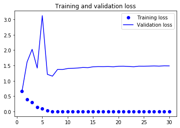
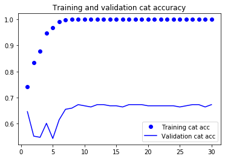
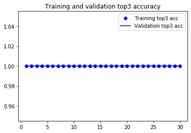
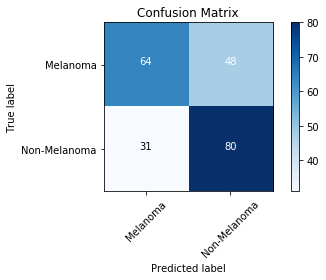

```python
import pandas as pd
import numpy as np

import tensorflow as tf
from tensorflow.keras.layers import Dense, Dropout
from tensorflow.keras.optimizers import Adam
from tensorflow.keras.metrics import categorical_crossentropy
from tensorflow.keras.preprocessing.image import ImageDataGenerator
from tensorflow.keras.models import Model
from tensorflow.keras.callbacks import EarlyStopping, ReduceLROnPlateau, ModelCheckpoint
from tensorflow.keras.metrics import categorical_accuracy, top_k_categorical_accuracy

import os
from glob import glob
import copy

from sklearn.metrics import confusion_matrix
from sklearn.model_selection import train_test_split
import itertools
import shutil
import matplotlib.pyplot as plt
```


```python
%matplotlib inline
%load_ext tensorboard
```

    The tensorboard extension is already loaded. To reload it, use:
      %reload_ext tensorboard
    

### Set Up the Generators


```python
train_path = '../data/train_dir'
valid_path = '../data/val_dir'

num_train_samples = 3853 + 3922
num_val_samples = 112 + 111
train_batch_size = 32
val_batch_size = 32
image_size = 224

train_steps = np.ceil(num_train_samples / train_batch_size)
val_steps = np.ceil(num_val_samples / val_batch_size)

```


```python

datagen = ImageDataGenerator(
    preprocessing_function= \
    tf.keras.applications.mobilenet.preprocess_input)

train_batches = datagen.flow_from_directory(train_path,
                                            target_size=(image_size,image_size),
                                            batch_size=train_batch_size)

valid_batches = datagen.flow_from_directory(valid_path,
                                            target_size=(image_size,image_size),
                                            batch_size=val_batch_size)

# Note: shuffle=False causes the test dataset to not be shuffled
test_batches = datagen.flow_from_directory(valid_path,
                                            target_size=(image_size,image_size),
                                            batch_size=1,
                                            shuffle=False)
```

    Found 7775 images belonging to 2 classes.
    Found 223 images belonging to 2 classes.
    Found 223 images belonging to 2 classes.
    

### Modify MobileNet Model


```python
# create a copy of a mobilenet model

mobile = tf.keras.applications.MobileNet()
```


```python
mobile.summary()
```


```python
type(mobile.layers)
```


    list


```python
# How many layers does MobileNet have?
len(mobile.layers)
```


    93


```python
# CREATE THE MODEL ARCHITECTURE

# Exclude the last 5 layers of the above model.
# This will include all layers up to and including global_average_pooling2d_1
x = mobile.layers[-6].output

# Create a new dense layer for predictions
# 7 corresponds to the number of classes
x = Dropout(0.25)(x)
predictions = Dense(2, activation='softmax')(x)

# inputs=mobile.input selects the input layer, outputs=predictions refers to the
# dense layer we created above.

model = Model(inputs=mobile.input, outputs=predictions)
```


```python
model.summary()
```


```python
# We need to choose how many layers we actually want to be trained.

# Here we are freezing the weights of all layers except the
# last 23 layers in the new model.
# The last 23 layers of the model will be trained.

for layer in model.layers[:-23]:
    layer.trainable = False
```

### Train the Model


```python
# Define Top2 and Top3 Accuracy
def top_3_accuracy(y_true, y_pred):
    return top_k_categorical_accuracy(y_true, y_pred, k=3)

def top_2_accuracy(y_true, y_pred):
    return top_k_categorical_accuracy(y_true, y_pred, k=2)
```


```python
model.compile(Adam(lr=0.01), loss='categorical_crossentropy', 
              metrics=[categorical_accuracy, top_2_accuracy, top_3_accuracy])
```


```python
# Get the labels that are associated with each index
print(valid_batches.class_indices)
```

    {'Melanoma': 0, 'Non-Melanoma': 1}
    


```python

filepath = "../models/model.h5"
checkpoint = ModelCheckpoint(filepath, monitor='val_top_3_accuracy', verbose=1, 
                             save_best_only=True, mode='max')

reduce_lr = ReduceLROnPlateau(monitor='val_top_3_accuracy', factor=0.5, patience=2, 
                                   verbose=1, mode='max', min_lr=0.00001)
                              
                              
callbacks_list = [checkpoint, reduce_lr]

history = model.fit_generator(train_batches, steps_per_epoch=train_steps,
                    validation_data=valid_batches,
                    validation_steps=val_steps,
                    epochs=30, verbose=1,
                   callbacks=callbacks_list)

```

    WARNING:tensorflow:From <ipython-input-113-5ce7235b3ad6>:15: Model.fit_generator (from tensorflow.python.keras.engine.training) is deprecated and will be removed in a future version.
    Instructions for updating:
    Please use Model.fit, which supports generators.
    WARNING:tensorflow:sample_weight modes were coerced from
      ...
        to  
      ['...']
    WARNING:tensorflow:sample_weight modes were coerced from
      ...
        to  
      ['...']
    Train for 243.0 steps, validate for 7.0 steps
    Epoch 1/30
    242/243 [============================>.] - ETA: 0s - loss: 0.6639 - categorical_accuracy: 0.7416 - top_2_accuracy: 1.0000 - top_3_accuracy: 1.0000
    Epoch 00001: val_top_3_accuracy improved from -inf to 1.00000, saving model to ../models/model.h5
    243/243 [==============================] - 73s 300ms/step - loss: 0.6630 - categorical_accuracy: 0.7417 - top_2_accuracy: 1.0000 - top_3_accuracy: 1.0000 - val_loss: 0.6524 - val_categorical_accuracy: 0.6457 - val_top_2_accuracy: 1.0000 - val_top_3_accuracy: 1.0000
    Epoch 2/30
    242/243 [============================>.] - ETA: 0s - loss: 0.3887 - categorical_accuracy: 0.8334 - top_2_accuracy: 1.0000 - top_3_accuracy: 1.0000
    Epoch 00002: val_top_3_accuracy did not improve from 1.00000
    243/243 [==============================] - 17s 70ms/step - loss: 0.3881 - categorical_accuracy: 0.8336 - top_2_accuracy: 1.0000 - top_3_accuracy: 1.0000 - val_loss: 1.6142 - val_categorical_accuracy: 0.5516 - val_top_2_accuracy: 1.0000 - val_top_3_accuracy: 1.0000
    Epoch 3/30
    242/243 [============================>.] - ETA: 0s - loss: 0.2996 - categorical_accuracy: 0.8769 - top_2_accuracy: 1.0000 - top_3_accuracy: 1.0000
    Epoch 00003: val_top_3_accuracy did not improve from 1.00000
    
    Epoch 00003: ReduceLROnPlateau reducing learning rate to 0.004999999888241291.
    243/243 [==============================] - 17s 71ms/step - loss: 0.2995 - categorical_accuracy: 0.8769 - top_2_accuracy: 1.0000 - top_3_accuracy: 1.0000 - val_loss: 2.0275 - val_categorical_accuracy: 0.5471 - val_top_2_accuracy: 1.0000 - val_top_3_accuracy: 1.0000
    Epoch 4/30
    242/243 [============================>.] - ETA: 0s - loss: 0.1445 - categorical_accuracy: 0.9477 - top_2_accuracy: 1.0000 - top_3_accuracy: 1.0000
    Epoch 00004: val_top_3_accuracy did not improve from 1.00000
    243/243 [==============================] - 16s 67ms/step - loss: 0.1452 - categorical_accuracy: 0.9473 - top_2_accuracy: 1.0000 - top_3_accuracy: 1.0000 - val_loss: 1.4161 - val_categorical_accuracy: 0.6009 - val_top_2_accuracy: 1.0000 - val_top_3_accuracy: 1.0000
    Epoch 5/30
    242/243 [============================>.] - ETA: 0s - loss: 0.0871 - categorical_accuracy: 0.9690 - top_2_accuracy: 1.0000 - top_3_accuracy: 1.0000
    Epoch 00005: val_top_3_accuracy did not improve from 1.00000
    
    Epoch 00005: ReduceLROnPlateau reducing learning rate to 0.0024999999441206455.
    243/243 [==============================] - 17s 70ms/step - loss: 0.0871 - categorical_accuracy: 0.9689 - top_2_accuracy: 1.0000 - top_3_accuracy: 1.0000 - val_loss: 3.1259 - val_categorical_accuracy: 0.5426 - val_top_2_accuracy: 1.0000 - val_top_3_accuracy: 1.0000
    Epoch 6/30
    242/243 [============================>.] - ETA: 0s - loss: 0.0270 - categorical_accuracy: 0.9921 - top_2_accuracy: 1.0000 - top_3_accuracy: 1.0000
    Epoch 00006: val_top_3_accuracy did not improve from 1.00000
    243/243 [==============================] - 16s 68ms/step - loss: 0.0271 - categorical_accuracy: 0.9920 - top_2_accuracy: 1.0000 - top_3_accuracy: 1.0000 - val_loss: 1.2111 - val_categorical_accuracy: 0.6143 - val_top_2_accuracy: 1.0000 - val_top_3_accuracy: 1.0000
    Epoch 7/30
    242/243 [============================>.] - ETA: 0s - loss: 0.0052 - categorical_accuracy: 0.9992 - top_2_accuracy: 1.0000 - top_3_accuracy: 1.0000
    Epoch 00007: val_top_3_accuracy did not improve from 1.00000
    
    Epoch 00007: ReduceLROnPlateau reducing learning rate to 0.0012499999720603228.
    243/243 [==============================] - 17s 68ms/step - loss: 0.0051 - categorical_accuracy: 0.9992 - top_2_accuracy: 1.0000 - top_3_accuracy: 1.0000 - val_loss: 1.1525 - val_categorical_accuracy: 0.6547 - val_top_2_accuracy: 1.0000 - val_top_3_accuracy: 1.0000
    Epoch 8/30
    242/243 [============================>.] - ETA: 0s - loss: 0.0015 - categorical_accuracy: 0.9999 - top_2_accuracy: 1.0000 - top_3_accuracy: 1.0000
    Epoch 00008: val_top_3_accuracy did not improve from 1.00000
    243/243 [==============================] - 17s 68ms/step - loss: 0.0015 - categorical_accuracy: 0.9999 - top_2_accuracy: 1.0000 - top_3_accuracy: 1.0000 - val_loss: 1.3705 - val_categorical_accuracy: 0.6592 - val_top_2_accuracy: 1.0000 - val_top_3_accuracy: 1.0000
    Epoch 9/30
    242/243 [============================>.] - ETA: 0s - loss: 8.1728e-04 - categorical_accuracy: 0.9999 - top_2_accuracy: 1.0000 - top_3_accuracy: 1.0000
    Epoch 00009: val_top_3_accuracy did not improve from 1.00000
    
    Epoch 00009: ReduceLROnPlateau reducing learning rate to 0.0006249999860301614.
    243/243 [==============================] - 16s 68ms/step - loss: 8.1452e-04 - categorical_accuracy: 0.9999 - top_2_accuracy: 1.0000 - top_3_accuracy: 1.0000 - val_loss: 1.3690 - val_categorical_accuracy: 0.6726 - val_top_2_accuracy: 1.0000 - val_top_3_accuracy: 1.0000
    Epoch 10/30
    242/243 [============================>.] - ETA: 0s - loss: 4.2680e-04 - categorical_accuracy: 1.0000 - top_2_accuracy: 1.0000 - top_3_accuracy: 1.0000
    Epoch 00010: val_top_3_accuracy did not improve from 1.00000
    243/243 [==============================] - 17s 68ms/step - loss: 4.2592e-04 - categorical_accuracy: 1.0000 - top_2_accuracy: 1.0000 - top_3_accuracy: 1.0000 - val_loss: 1.4007 - val_categorical_accuracy: 0.6682 - val_top_2_accuracy: 1.0000 - val_top_3_accuracy: 1.0000
    Epoch 11/30
    242/243 [============================>.] - ETA: 0s - loss: 3.4800e-04 - categorical_accuracy: 1.0000 - top_2_accuracy: 1.0000 - top_3_accuracy: 1.0000
    Epoch 00011: val_top_3_accuracy did not improve from 1.00000
    
    Epoch 00011: ReduceLROnPlateau reducing learning rate to 0.0003124999930150807.
    243/243 [==============================] - 17s 68ms/step - loss: 3.4755e-04 - categorical_accuracy: 1.0000 - top_2_accuracy: 1.0000 - top_3_accuracy: 1.0000 - val_loss: 1.4091 - val_categorical_accuracy: 0.6637 - val_top_2_accuracy: 1.0000 - val_top_3_accuracy: 1.0000
    Epoch 12/30
    242/243 [============================>.] - ETA: 0s - loss: 3.2108e-04 - categorical_accuracy: 1.0000 - top_2_accuracy: 1.0000 - top_3_accuracy: 1.0000
    Epoch 00012: val_top_3_accuracy did not improve from 1.00000
    243/243 [==============================] - 16s 67ms/step - loss: 3.2052e-04 - categorical_accuracy: 1.0000 - top_2_accuracy: 1.0000 - top_3_accuracy: 1.0000 - val_loss: 1.4173 - val_categorical_accuracy: 0.6726 - val_top_2_accuracy: 1.0000 - val_top_3_accuracy: 1.0000
    Epoch 13/30
    242/243 [============================>.] - ETA: 0s - loss: 3.0656e-04 - categorical_accuracy: 1.0000 - top_2_accuracy: 1.0000 - top_3_accuracy: 1.0000
    Epoch 00013: val_top_3_accuracy did not improve from 1.00000
    
    Epoch 00013: ReduceLROnPlateau reducing learning rate to 0.00015624999650754035.
    243/243 [==============================] - 17s 68ms/step - loss: 3.0547e-04 - categorical_accuracy: 1.0000 - top_2_accuracy: 1.0000 - top_3_accuracy: 1.0000 - val_loss: 1.4352 - val_categorical_accuracy: 0.6726 - val_top_2_accuracy: 1.0000 - val_top_3_accuracy: 1.0000
    Epoch 14/30
    242/243 [============================>.] - ETA: 0s - loss: 2.8476e-04 - categorical_accuracy: 1.0000 - top_2_accuracy: 1.0000 - top_3_accuracy: 1.0000
    Epoch 00014: val_top_3_accuracy did not improve from 1.00000
    243/243 [==============================] - 17s 70ms/step - loss: 2.8534e-04 - categorical_accuracy: 1.0000 - top_2_accuracy: 1.0000 - top_3_accuracy: 1.0000 - val_loss: 1.4291 - val_categorical_accuracy: 0.6682 - val_top_2_accuracy: 1.0000 - val_top_3_accuracy: 1.0000
    Epoch 15/30
    242/243 [============================>.] - ETA: 0s - loss: 2.6439e-04 - categorical_accuracy: 1.0000 - top_2_accuracy: 1.0000 - top_3_accuracy: 1.0000
    Epoch 00015: val_top_3_accuracy did not improve from 1.00000
    
    Epoch 00015: ReduceLROnPlateau reducing learning rate to 7.812499825377017e-05.
    243/243 [==============================] - 17s 69ms/step - loss: 2.6853e-04 - categorical_accuracy: 1.0000 - top_2_accuracy: 1.0000 - top_3_accuracy: 1.0000 - val_loss: 1.4577 - val_categorical_accuracy: 0.6682 - val_top_2_accuracy: 1.0000 - val_top_3_accuracy: 1.0000
    Epoch 16/30
    242/243 [============================>.] - ETA: 0s - loss: 2.6424e-04 - categorical_accuracy: 1.0000 - top_2_accuracy: 1.0000 - top_3_accuracy: 1.0000
    Epoch 00016: val_top_3_accuracy did not improve from 1.00000
    243/243 [==============================] - 17s 70ms/step - loss: 2.6453e-04 - categorical_accuracy: 1.0000 - top_2_accuracy: 1.0000 - top_3_accuracy: 1.0000 - val_loss: 1.4636 - val_categorical_accuracy: 0.6637 - val_top_2_accuracy: 1.0000 - val_top_3_accuracy: 1.0000
    Epoch 17/30
    242/243 [============================>.] - ETA: 0s - loss: 2.4265e-04 - categorical_accuracy: 1.0000 - top_2_accuracy: 1.0000 - top_3_accuracy: 1.0000
    Epoch 00017: val_top_3_accuracy did not improve from 1.00000
    
    Epoch 00017: ReduceLROnPlateau reducing learning rate to 3.9062499126885086e-05.
    243/243 [==============================] - 17s 70ms/step - loss: 2.4244e-04 - categorical_accuracy: 1.0000 - top_2_accuracy: 1.0000 - top_3_accuracy: 1.0000 - val_loss: 1.4626 - val_categorical_accuracy: 0.6726 - val_top_2_accuracy: 1.0000 - val_top_3_accuracy: 1.0000
    Epoch 18/30
    242/243 [============================>.] - ETA: 0s - loss: 2.3625e-04 - categorical_accuracy: 1.0000 - top_2_accuracy: 1.0000 - top_3_accuracy: 1.0000
    Epoch 00018: val_top_3_accuracy did not improve from 1.00000
    243/243 [==============================] - 16s 67ms/step - loss: 2.3612e-04 - categorical_accuracy: 1.0000 - top_2_accuracy: 1.0000 - top_3_accuracy: 1.0000 - val_loss: 1.4662 - val_categorical_accuracy: 0.6726 - val_top_2_accuracy: 1.0000 - val_top_3_accuracy: 1.0000
    Epoch 19/30
    242/243 [============================>.] - ETA: 0s - loss: 2.4088e-04 - categorical_accuracy: 1.0000 - top_2_accuracy: 1.0000 - top_3_accuracy: 1.0000
    Epoch 00019: val_top_3_accuracy did not improve from 1.00000
    
    Epoch 00019: ReduceLROnPlateau reducing learning rate to 1.9531249563442543e-05.
    243/243 [==============================] - 17s 68ms/step - loss: 2.4076e-04 - categorical_accuracy: 1.0000 - top_2_accuracy: 1.0000 - top_3_accuracy: 1.0000 - val_loss: 1.4583 - val_categorical_accuracy: 0.6726 - val_top_2_accuracy: 1.0000 - val_top_3_accuracy: 1.0000
    Epoch 20/30
    242/243 [============================>.] - ETA: 0s - loss: 2.4291e-04 - categorical_accuracy: 1.0000 - top_2_accuracy: 1.0000 - top_3_accuracy: 1.0000
    Epoch 00020: val_top_3_accuracy did not improve from 1.00000
    243/243 [==============================] - 16s 67ms/step - loss: 2.4199e-04 - categorical_accuracy: 1.0000 - top_2_accuracy: 1.0000 - top_3_accuracy: 1.0000 - val_loss: 1.4745 - val_categorical_accuracy: 0.6682 - val_top_2_accuracy: 1.0000 - val_top_3_accuracy: 1.0000
    Epoch 21/30
    242/243 [============================>.] - ETA: 0s - loss: 2.1882e-04 - categorical_accuracy: 1.0000 - top_2_accuracy: 1.0000 - top_3_accuracy: 1.0000
    Epoch 00021: val_top_3_accuracy did not improve from 1.00000
    
    Epoch 00021: ReduceLROnPlateau reducing learning rate to 1e-05.
    243/243 [==============================] - 17s 68ms/step - loss: 2.1874e-04 - categorical_accuracy: 1.0000 - top_2_accuracy: 1.0000 - top_3_accuracy: 1.0000 - val_loss: 1.4761 - val_categorical_accuracy: 0.6682 - val_top_2_accuracy: 1.0000 - val_top_3_accuracy: 1.0000
    Epoch 22/30
    242/243 [============================>.] - ETA: 0s - loss: 2.3134e-04 - categorical_accuracy: 1.0000 - top_2_accuracy: 1.0000 - top_3_accuracy: 1.0000
    Epoch 00022: val_top_3_accuracy did not improve from 1.00000
    243/243 [==============================] - 16s 67ms/step - loss: 2.3050e-04 - categorical_accuracy: 1.0000 - top_2_accuracy: 1.0000 - top_3_accuracy: 1.0000 - val_loss: 1.4683 - val_categorical_accuracy: 0.6682 - val_top_2_accuracy: 1.0000 - val_top_3_accuracy: 1.0000
    Epoch 23/30
    242/243 [============================>.] - ETA: 0s - loss: 2.3078e-04 - categorical_accuracy: 1.0000 - top_2_accuracy: 1.0000 - top_3_accuracy: 1.0000
    Epoch 00023: val_top_3_accuracy did not improve from 1.00000
    243/243 [==============================] - 16s 67ms/step - loss: 2.3065e-04 - categorical_accuracy: 1.0000 - top_2_accuracy: 1.0000 - top_3_accuracy: 1.0000 - val_loss: 1.4590 - val_categorical_accuracy: 0.6682 - val_top_2_accuracy: 1.0000 - val_top_3_accuracy: 1.0000
    Epoch 24/30
    242/243 [============================>.] - ETA: 0s - loss: 2.3235e-04 - categorical_accuracy: 1.0000 - top_2_accuracy: 1.0000 - top_3_accuracy: 1.0000
    Epoch 00024: val_top_3_accuracy did not improve from 1.00000
    243/243 [==============================] - 16s 67ms/step - loss: 2.3169e-04 - categorical_accuracy: 1.0000 - top_2_accuracy: 1.0000 - top_3_accuracy: 1.0000 - val_loss: 1.4769 - val_categorical_accuracy: 0.6682 - val_top_2_accuracy: 1.0000 - val_top_3_accuracy: 1.0000
    Epoch 25/30
    242/243 [============================>.] - ETA: 0s - loss: 2.4113e-04 - categorical_accuracy: 1.0000 - top_2_accuracy: 1.0000 - top_3_accuracy: 1.0000
    Epoch 00025: val_top_3_accuracy did not improve from 1.00000
    243/243 [==============================] - 16s 67ms/step - loss: 2.4117e-04 - categorical_accuracy: 1.0000 - top_2_accuracy: 1.0000 - top_3_accuracy: 1.0000 - val_loss: 1.4760 - val_categorical_accuracy: 0.6637 - val_top_2_accuracy: 1.0000 - val_top_3_accuracy: 1.0000
    Epoch 26/30
    242/243 [============================>.] - ETA: 0s - loss: 2.1180e-04 - categorical_accuracy: 1.0000 - top_2_accuracy: 1.0000 - top_3_accuracy: 1.0000
    Epoch 00026: val_top_3_accuracy did not improve from 1.00000
    243/243 [==============================] - 17s 70ms/step - loss: 2.1128e-04 - categorical_accuracy: 1.0000 - top_2_accuracy: 1.0000 - top_3_accuracy: 1.0000 - val_loss: 1.4790 - val_categorical_accuracy: 0.6682 - val_top_2_accuracy: 1.0000 - val_top_3_accuracy: 1.0000
    Epoch 27/30
    242/243 [============================>.] - ETA: 0s - loss: 2.2140e-04 - categorical_accuracy: 1.0000 - top_2_accuracy: 1.0000 - top_3_accuracy: 1.0000
    Epoch 00027: val_top_3_accuracy did not improve from 1.00000
    243/243 [==============================] - 17s 69ms/step - loss: 2.2532e-04 - categorical_accuracy: 1.0000 - top_2_accuracy: 1.0000 - top_3_accuracy: 1.0000 - val_loss: 1.4848 - val_categorical_accuracy: 0.6726 - val_top_2_accuracy: 1.0000 - val_top_3_accuracy: 1.0000
    Epoch 28/30
    242/243 [============================>.] - ETA: 0s - loss: 2.1058e-04 - categorical_accuracy: 1.0000 - top_2_accuracy: 1.0000 - top_3_accuracy: 1.0000
    Epoch 00028: val_top_3_accuracy did not improve from 1.00000
    243/243 [==============================] - 17s 70ms/step - loss: 2.0987e-04 - categorical_accuracy: 1.0000 - top_2_accuracy: 1.0000 - top_3_accuracy: 1.0000 - val_loss: 1.4785 - val_categorical_accuracy: 0.6726 - val_top_2_accuracy: 1.0000 - val_top_3_accuracy: 1.0000
    Epoch 29/30
    242/243 [============================>.] - ETA: 0s - loss: 2.1530e-04 - categorical_accuracy: 1.0000 - top_2_accuracy: 1.0000 - top_3_accuracy: 1.0000
    Epoch 00029: val_top_3_accuracy did not improve from 1.00000
    243/243 [==============================] - 17s 70ms/step - loss: 2.1463e-04 - categorical_accuracy: 1.0000 - top_2_accuracy: 1.0000 - top_3_accuracy: 1.0000 - val_loss: 1.4899 - val_categorical_accuracy: 0.6637 - val_top_2_accuracy: 1.0000 - val_top_3_accuracy: 1.0000
    Epoch 30/30
    242/243 [============================>.] - ETA: 0s - loss: 2.0197e-04 - categorical_accuracy: 1.0000 - top_2_accuracy: 1.0000 - top_3_accuracy: 1.0000
    Epoch 00030: val_top_3_accuracy did not improve from 1.00000
    243/243 [==============================] - 17s 69ms/step - loss: 2.0291e-04 - categorical_accuracy: 1.0000 - top_2_accuracy: 1.0000 - top_3_accuracy: 1.0000 - val_loss: 1.4872 - val_categorical_accuracy: 0.6726 - val_top_2_accuracy: 1.0000 - val_top_3_accuracy: 1.0000
    

### Evaluate the model using the val set


```python
# get the metric names so we can use evaulate_generator
model.metrics_names
```


    ['loss', 'categorical_accuracy', 'top_2_accuracy', 'top_3_accuracy']


```python
# Here the the last epoch will be used.

val_loss, val_cat_acc, val_top_2_acc, val_top_3_acc = \
model.evaluate_generator(test_batches, 
                        steps=len(df_val))

print('val_loss:', val_loss)
print('val_cat_acc:', val_cat_acc)
print('val_top_2_acc:', val_top_2_acc)
print('val_top_3_acc:', val_top_3_acc)
```

    WARNING:tensorflow:From <ipython-input-115-386e7eab37b7>:5: Model.evaluate_generator (from tensorflow.python.keras.engine.training) is deprecated and will be removed in a future version.
    Instructions for updating:
    Please use Model.evaluate, which supports generators.
    WARNING:tensorflow:sample_weight modes were coerced from
      ...
        to  
      ['...']
    val_loss: 1.486123209665764
    val_cat_acc: 0.67264575
    val_top_2_acc: 1.0
    val_top_3_acc: 1.0
    


```python
os.listdir('../models/')
```


    ['model.h5']


```python
# Here the best epoch will be used.

#model.load_weights('../input/skin-cancer-model/model.h5')
model.load_weights('../models/model.h5')
val_loss, val_cat_acc, val_top_2_acc, val_top_3_acc = \
model.evaluate_generator(test_batches, 
                        steps=len(df_val))

print('val_loss:', val_loss)
print('val_cat_acc:', val_cat_acc)
print('val_top_2_acc:', val_top_2_acc)
print('val_top_3_acc:', val_top_3_acc)
```

    WARNING:tensorflow:sample_weight modes were coerced from
      ...
        to  
      ['...']
    val_loss: 0.6517377003784356
    val_cat_acc: 0.6457399
    val_top_2_acc: 1.0
    val_top_3_acc: 1.0
    

### Plot the Training Curves


```python
# display the loss and accuracy curves

import matplotlib.pyplot as plt

acc = history.history['categorical_accuracy']
val_acc = history.history['val_categorical_accuracy']
loss = history.history['loss']
val_loss = history.history['val_loss']
train_top2_acc = history.history['top_2_accuracy']
val_top2_acc = history.history['val_top_2_accuracy']
train_top3_acc = history.history['top_3_accuracy']
val_top3_acc = history.history['val_top_3_accuracy']
epochs = range(1, len(acc) + 1)

plt.plot(epochs, loss, 'bo', label='Training loss')
plt.plot(epochs, val_loss, 'b', label='Validation loss')
plt.title('Training and validation loss')
plt.legend()
plt.figure()

plt.plot(epochs, acc, 'bo', label='Training cat acc')
plt.plot(epochs, val_acc, 'b', label='Validation cat acc')
plt.title('Training and validation cat accuracy')
plt.legend()
plt.figure()


plt.plot(epochs, train_top2_acc, 'bo', label='Training top2 acc')
plt.plot(epochs, val_top2_acc, 'b', label='Validation top2 acc')
plt.title('Training and validation top2 accuracy')
plt.legend()
plt.figure()
plt.plot(epochs, train_top3_acc, 'bo', label='Training top3 acc')
plt.plot(epochs, val_top3_acc, 'b', label='Validation top3 acc')
plt.title('Training and validation top3 accuracy')
plt.legend()


plt.show()
```











### Create a Confusion Matrix


```python
# Get the labels of the test images.

test_labels = test_batches.classes
```


```python
# We need these to plot the confusion matrix.
test_labels
```


    array([0, 0, 0, 0, 0, 0, 0, 0, 0, 0, 0, 0, 0, 0, 0, 0, 0, 0, 0, 0, 0, 0,
           0, 0, 0, 0, 0, 0, 0, 0, 0, 0, 0, 0, 0, 0, 0, 0, 0, 0, 0, 0, 0, 0,
           0, 0, 0, 0, 0, 0, 0, 0, 0, 0, 0, 0, 0, 0, 0, 0, 0, 0, 0, 0, 0, 0,
           0, 0, 0, 0, 0, 0, 0, 0, 0, 0, 0, 0, 0, 0, 0, 0, 0, 0, 0, 0, 0, 0,
           0, 0, 0, 0, 0, 0, 0, 0, 0, 0, 0, 0, 0, 0, 0, 0, 0, 0, 0, 0, 0, 0,
           0, 0, 1, 1, 1, 1, 1, 1, 1, 1, 1, 1, 1, 1, 1, 1, 1, 1, 1, 1, 1, 1,
           1, 1, 1, 1, 1, 1, 1, 1, 1, 1, 1, 1, 1, 1, 1, 1, 1, 1, 1, 1, 1, 1,
           1, 1, 1, 1, 1, 1, 1, 1, 1, 1, 1, 1, 1, 1, 1, 1, 1, 1, 1, 1, 1, 1,
           1, 1, 1, 1, 1, 1, 1, 1, 1, 1, 1, 1, 1, 1, 1, 1, 1, 1, 1, 1, 1, 1,
           1, 1, 1, 1, 1, 1, 1, 1, 1, 1, 1, 1, 1, 1, 1, 1, 1, 1, 1, 1, 1, 1,
           1, 1, 1])


```python
# Print the label associated with each class
test_batches.class_indices
```


    {'Melanoma': 0, 'Non-Melanoma': 1}


```python
# make a prediction
predictions = model.predict_generator(test_batches, steps=len(df_val), verbose=1)
```

    WARNING:tensorflow:From <ipython-input-125-9c0b47a7196d>:2: Model.predict_generator (from tensorflow.python.keras.engine.training) is deprecated and will be removed in a future version.
    Instructions for updating:
    Please use Model.predict, which supports generators.
    223/223 [==============================] - 2s 7ms/step
    


```python
predictions.shape
```


    (223, 2)


```python
# Source: Scikit Learn website
# http://scikit-learn.org/stable/auto_examples/
# model_selection/plot_confusion_matrix.html#sphx-glr-auto-examples-model-
# selection-plot-confusion-matrix-py


def plot_confusion_matrix(cm, classes,
                          normalize=False,
                          title='Confusion matrix',
                          cmap=plt.cm.Blues):
    """
    This function prints and plots the confusion matrix.
    Normalization can be applied by setting `normalize=True`.
    """
    if normalize:
        cm = cm.astype('float') / cm.sum(axis=1)[:, np.newaxis]
        print("Normalized confusion matrix")
    else:
        print('Confusion matrix, without normalization')

    print(cm)

    plt.imshow(cm, interpolation='nearest', cmap=cmap)
    plt.title(title)
    plt.colorbar()
    tick_marks = np.arange(len(classes))
    plt.xticks(tick_marks, classes, rotation=45)
    plt.yticks(tick_marks, classes)

    fmt = '.2f' if normalize else 'd'
    thresh = cm.max() / 2.
    for i, j in itertools.product(range(cm.shape[0]), range(cm.shape[1])):
        plt.text(j, i, format(cm[i, j], fmt),
                 horizontalalignment="center",
                 color="white" if cm[i, j] > thresh else "black")

    plt.ylabel('True label')
    plt.xlabel('Predicted label')
    plt.tight_layout()


```


```python
test_labels.shape
```


    (223,)


```python
# argmax returns the index of the max value in a row
cm = confusion_matrix(test_labels, predictions.argmax(axis=1))
```


```python
test_batches.class_indices
```


    {'Melanoma': 0, 'Non-Melanoma': 1}


```python
# Define the labels of the class indices. These need to match the 
# order shown above.
cm_plot_labels = ['Melanoma', 'Non-Melanoma']

plot_confusion_matrix(cm, cm_plot_labels, title='Confusion Matrix')
```

    Confusion matrix, without normalization
    [[64 48]
     [31 80]]
    





### Generate the Classification Report


```python
# Get the index of the class with the highest probability score
y_pred = np.argmax(predictions, axis=1)

# Get the labels of the test images.
y_true = test_batches.classes
```


```python
from sklearn.metrics import classification_report

# Generate a classification report
report = classification_report(y_true, y_pred, target_names=cm_plot_labels)

print(report)
```

                  precision    recall  f1-score   support
    
        Melanoma       0.67      0.57      0.62       112
    Non-Melanoma       0.62      0.72      0.67       111
    
        accuracy                           0.65       223
       macro avg       0.65      0.65      0.64       223
    weighted avg       0.65      0.65      0.64       223
    
    

**Recall** = Given a class, will the classifier be able to detect it?<br>
**Precision** = Given a class prediction from a classifier, how likely is it to be correct?<br>
**F1 Score** = The harmonic mean of the recall and precision. Essentially, it punishes extreme values.


```python

```
