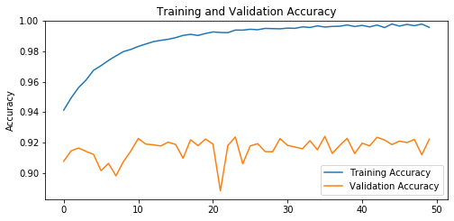
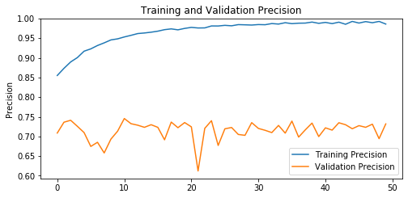
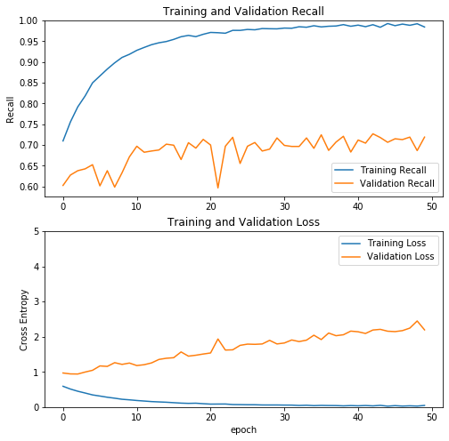

```python
import numpy as np
import pandas as pd

import tensorflow as tf
from tensorflow import keras
from glob import glob
from sklearn.utils import resample
from imblearn.over_sampling import RandomOverSampler

from tensorflow.keras.optimizers import Adam
from tensorflow.keras.layers import Dense, Conv2D, MaxPool2D, Flatten, GlobalAveragePooling2D
from tensorflow.keras.preprocessing.image import ImageDataGenerator
from tensorflow.keras.models import Model

import IPython.display as display
from PIL import Image
import numpy as np
import matplotlib.pyplot as plt

print(tf.__version__)
```

    2.1.0
    


```python
# From https://www.kaggle.com/elvinj1203/resnet50-84-test-acc
data=pd.read_csv("../data/HAM10000_metadata.csv")
data['image_full_name']=data['image_id']+'.jpg'
X=data[['image_full_name','dx','lesion_id']]
```


```python
from sklearn.model_selection import train_test_split
Y=X.pop('dx').to_frame()
X_train, X_test, y_train, y_test   = train_test_split(X,Y, test_size=0.2, random_state=42)
X_train,X_val,y_train,y_val        =train_test_split(X_train, y_train, test_size=0.25, random_state=42)
```


```python
#Oversampling
ros = RandomOverSampler(sampling_strategy='not majority',
                    random_state=42)
X_upsampled, Y_upsampled = ros.fit_resample(X_train, y_train)
```


```python
Y_upsampled.dx.value_counts()
```


    bcc      4050
    bkl      4050
    mel      4050
    nv       4050
    akiec    4050
    df       4050
    vasc     4050
    Name: dx, dtype: int64


```python
#train=pd.concat([X_train,y_train],axis=1)
train_upsampled = pd.concat([X_upsampled, Y_upsampled], axis=1)
val=pd.concat([X_val,y_val],axis=1)
test=pd.concat([X_test,y_test],axis=1)
```


```python
"""image_full_name 	lesion_id 	dx
482 	ISIC_0030346.jpg 	HAM_0005146 	bkl
7123 	ISIC_0032007.jpg 	HAM_0007477 	nv
6581 	ISIC_0030449.jpg 	HAM_0007071 	nv
6991 	ISIC_0025812.jpg 	HAM_0001767 	nv
6333 	ISIC_0027587.jpg 	HAM_0003907 	nv"""
```


    'image_full_name \tlesion_id \tdx\n482 \tISIC_0030346.jpg \tHAM_0005146 \tbkl\n7123 \tISIC_0032007.jpg \tHAM_0007477 \tnv\n6581 \tISIC_0030449.jpg \tHAM_0007071 \tnv\n6991 \tISIC_0025812.jpg \tHAM_0001767 \tnv\n6333 \tISIC_0027587.jpg \tHAM_0003907 \tnv'


```python
val.dx.value_counts()
```


    nv       1317
    bkl       243
    mel       230
    bcc       111
    akiec      57
    vasc       27
    df         18
    Name: dx, dtype: int64


```python
test.dx.value_counts()
```


    nv       1338
    bkl       228
    mel       226
    bcc        93
    akiec      69
    df         28
    vasc       21
    Name: dx, dtype: int64


```python
image_path = '../data/HAM10000'
```


```python
# The 1./255 is to convert from uint8 to float32 in range [0,1].
# horizontal_flip=True to flip images randomly
image_generator = ImageDataGenerator(
    rescale=1./255)

BATCH_SIZE = 32
IMG_SIZE_128 = (128, 128)
#STEPS_PER_EPOCH = np.ceil(image_count/BATCH_SIZE)

# !!!! This train_generator is oversampled train
train_generator = image_generator.flow_from_dataframe(
    dataframe=train_upsampled,
    directory=image_path,
    x_col="image_full_name", # x_col = file name
    y_col="dx",
    batch_size=BATCH_SIZE,
    seed=42,
    shuffle=True,
    class_mode="categorical",
    target_size=(IMG_SIZE_128)
)

val_generator = image_generator.flow_from_dataframe(
    dataframe=val,
    directory=image_path,
    x_col="image_full_name", # x_col = file name
    y_col="dx",
    batch_size=BATCH_SIZE,
    seed=42,
    shuffle=True,
    class_mode="categorical",
    target_size=(IMG_SIZE_128)
)

test_generator = image_generator.flow_from_dataframe(
    dataframe=test,
    directory=image_path,
    x_col="image_full_name", # x_col = file name
    y_col="dx",
    batch_size=BATCH_SIZE,
    seed=42,
    shuffle=True,
    class_mode="categorical",
    target_size=(IMG_SIZE_128)
)
```

    Found 28350 validated image filenames belonging to 7 classes.
    Found 2003 validated image filenames belonging to 7 classes.
    Found 2003 validated image filenames belonging to 7 classes.
    


```python
METRICS = [
      keras.metrics.TruePositives(name='tp'),
      keras.metrics.FalsePositives(name='fp'),
      keras.metrics.TrueNegatives(name='tn'),
      keras.metrics.FalseNegatives(name='fn'), 
      keras.metrics.BinaryAccuracy(name='accuracy'),
      keras.metrics.Precision(name='precision'),
      keras.metrics.Recall(name='recall'),
      keras.metrics.AUC(name='auc')
]
```


```python
def MobileNetV2_frozen(img_size=None):
  # Import the mobilenetV2 model and discards the last 1000 neuron layer.
    base_model = keras.applications.mobilenet_v2.MobileNetV2(weights='imagenet',include_top=False, input_shape=img_size)
    print("Number of layers in the base model: ", len(base_model.layers))
    base_model.trainable = False
    x = base_model.output
    x = GlobalAveragePooling2D()(x)
  # Dense = FullyConnected
    x = Dense(1024,activation='relu')(x) 
  # Final layer with softmax activation
    pred_layer = Dense(7, activation='softmax')(x) 

    model = Model(inputs=base_model.input,outputs=pred_layer)
    return model

```


```python
def VGG16_frozen(img_size=None):
    base_model = keras.applications.vgg16.VGG16(weights='imagenet', include_top=False, input_shape=img_size)
    print('Number of layers of the base model: ', len(base_model.layers))
    base_model.trainable = False
    x = base_model.output
    x = GlobalAveragePooling2D()(x)
    x = Dense(1024, activation='relu')(x)
    
    prediction = Dense(7, activation='softmax')(x)
    model = Model(inputs=base_model.input, outputs=prediction)
    return model
```


```python
model = VGG16_frozen((128,128,3))
model.summary()

# Adam learning rate
#opt = Adam(lr=0.001)

model.compile(optimizer='adam',
              loss='categorical_crossentropy',
              metrics=METRICS)
```

    Number of layers of the base model:  19
    Model: "model_3"
    _________________________________________________________________
    Layer (type)                 Output Shape              Param #   
    =================================================================
    input_4 (InputLayer)         [(None, 128, 128, 3)]     0         
    _________________________________________________________________
    block1_conv1 (Conv2D)        (None, 128, 128, 64)      1792      
    _________________________________________________________________
    block1_conv2 (Conv2D)        (None, 128, 128, 64)      36928     
    _________________________________________________________________
    block1_pool (MaxPooling2D)   (None, 64, 64, 64)        0         
    _________________________________________________________________
    block2_conv1 (Conv2D)        (None, 64, 64, 128)       73856     
    _________________________________________________________________
    block2_conv2 (Conv2D)        (None, 64, 64, 128)       147584    
    _________________________________________________________________
    block2_pool (MaxPooling2D)   (None, 32, 32, 128)       0         
    _________________________________________________________________
    block3_conv1 (Conv2D)        (None, 32, 32, 256)       295168    
    _________________________________________________________________
    block3_conv2 (Conv2D)        (None, 32, 32, 256)       590080    
    _________________________________________________________________
    block3_conv3 (Conv2D)        (None, 32, 32, 256)       590080    
    _________________________________________________________________
    block3_pool (MaxPooling2D)   (None, 16, 16, 256)       0         
    _________________________________________________________________
    block4_conv1 (Conv2D)        (None, 16, 16, 512)       1180160   
    _________________________________________________________________
    block4_conv2 (Conv2D)        (None, 16, 16, 512)       2359808   
    _________________________________________________________________
    block4_conv3 (Conv2D)        (None, 16, 16, 512)       2359808   
    _________________________________________________________________
    block4_pool (MaxPooling2D)   (None, 8, 8, 512)         0         
    _________________________________________________________________
    block5_conv1 (Conv2D)        (None, 8, 8, 512)         2359808   
    _________________________________________________________________
    block5_conv2 (Conv2D)        (None, 8, 8, 512)         2359808   
    _________________________________________________________________
    block5_conv3 (Conv2D)        (None, 8, 8, 512)         2359808   
    _________________________________________________________________
    block5_pool (MaxPooling2D)   (None, 4, 4, 512)         0         
    _________________________________________________________________
    global_average_pooling2d_3 ( (None, 512)               0         
    _________________________________________________________________
    dense_6 (Dense)              (None, 1024)              525312    
    _________________________________________________________________
    dense_7 (Dense)              (None, 7)                 7175      
    =================================================================
    Total params: 15,247,175
    Trainable params: 532,487
    Non-trainable params: 14,714,688
    _________________________________________________________________
    


```python
vgg16_frozen_path = "vgg16_frozen.ckpt"
vgg16_frozen_dir = '/output/working/' + vgg16_frozen_path
```


```python
saveCheckpoint = tf.keras.callbacks.ModelCheckpoint(
    filepath=vgg16_frozen_dir, 
    verbose=1, 
    save_weights_only=True,
    period=5)
```

    WARNING:tensorflow:`period` argument is deprecated. Please use `save_freq` to specify the frequency in number of samples seen.
    


```python
"""mobileNetV2_frozen_path = "mobileNetV2_frozen.ckpt"
mobileNetV2_frozen_dir = '/output/working/' + mobileNetV2_frozen_path

mobileNetV2_trainable_path = "mobileNetV2_trainable.ckpt"
mobileNetV2_trainable_dir = '/output/working/' + mobileNetV2_trainable_path"""
```


```python
saveCheckpoint = tf.keras.callbacks.ModelCheckpoint(
    filepath=mobileNetV2_frozen_dir, 
    verbose=1, 
    save_weights_only=True,
    period=5)

saveCheckpointTrainable = tf.keras.callbacks.ModelCheckpoint(
    filepath=mobileNetV2_trainable_dir, 
    verbose=1, 
    save_weights_only=True,
    period=5)
```

    WARNING:tensorflow:`period` argument is deprecated. Please use `save_freq` to specify the frequency in number of samples seen.
    WARNING:tensorflow:`period` argument is deprecated. Please use `save_freq` to specify the frequency in number of samples seen.
    


```python
history = model.fit(
    train_generator,
    validation_data=val_generator,
    epochs=50,
    callbacks=[saveCheckpoint]
)
```

    WARNING:tensorflow:sample_weight modes were coerced from
      ...
        to  
      ['...']
    WARNING:tensorflow:sample_weight modes were coerced from
      ...
        to  
      ['...']
    Train for 886 steps, validate for 63 steps
    Epoch 1/50
    886/886 [==============================] - 299s 338ms/step - loss: 0.5906 - tp: 20120.0000 - fp: 3402.0000 - tn: 166698.0000 - fn: 8230.0000 - accuracy: 0.9414 - precision: 0.8554 - recall: 0.7097 - auc: 0.9713 - val_loss: 0.9685 - val_tp: 1207.0000 - val_fp: 496.0000 - val_tn: 11522.0000 - val_fn: 796.0000 - val_accuracy: 0.9079 - val_precision: 0.7087 - val_recall: 0.6026 - val_auc: 0.9281
    Epoch 2/50
    885/886 [============================>.] - ETA: 0s - loss: 0.5119 - tp: 21388.0000 - fp: 3095.0000 - tn: 166813.0000 - fn: 6930.0000 - accuracy: 0.9494 - precision: 0.8736 - recall: 0.7553 - auc: 0.9783
    Epoch 00002: saving model to /output/working/vgg16_frozen.ckpt
    886/886 [==============================] - 301s 339ms/step - loss: 0.5118 - tp: 21415.0000 - fp: 3099.0000 - tn: 167001.0000 - fn: 6935.0000 - accuracy: 0.9494 - precision: 0.8736 - recall: 0.7554 - auc: 0.9783 - val_loss: 0.9425 - val_tp: 1257.0000 - val_fp: 450.0000 - val_tn: 11568.0000 - val_fn: 746.0000 - val_accuracy: 0.9147 - val_precision: 0.7364 - val_recall: 0.6276 - val_auc: 0.9328
    Epoch 3/50
    886/886 [==============================] - 298s 337ms/step - loss: 0.4495 - tp: 22447.0000 - fp: 2778.0000 - tn: 167322.0000 - fn: 5903.0000 - accuracy: 0.9563 - precision: 0.8899 - recall: 0.7918 - auc: 0.9831 - val_loss: 0.9394 - val_tp: 1278.0000 - val_fp: 446.0000 - val_tn: 11572.0000 - val_fn: 725.0000 - val_accuracy: 0.9165 - val_precision: 0.7413 - val_recall: 0.6380 - val_auc: 0.9351
    Epoch 4/50
    886/886 [==============================] - 298s 336ms/step - loss: 0.3985 - tp: 23195.0000 - fp: 2550.0000 - tn: 167550.0000 - fn: 5155.0000 - accuracy: 0.9612 - precision: 0.9010 - recall: 0.8182 - auc: 0.9866 - val_loss: 0.9955 - val_tp: 1287.0000 - val_fp: 486.0000 - val_tn: 11532.0000 - val_fn: 716.0000 - val_accuracy: 0.9143 - val_precision: 0.7259 - val_recall: 0.6425 - val_auc: 0.9321
    Epoch 5/50
    886/886 [==============================] - 297s 335ms/step - loss: 0.3451 - tp: 24086.0000 - fp: 2173.0000 - tn: 167927.0000 - fn: 4264.0000 - accuracy: 0.9676 - precision: 0.9172 - recall: 0.8496 - auc: 0.9898 - val_loss: 1.0452 - val_tp: 1307.0000 - val_fp: 534.0000 - val_tn: 11484.0000 - val_fn: 696.0000 - val_accuracy: 0.9123 - val_precision: 0.7099 - val_recall: 0.6525 - val_auc: 0.9311
    Epoch 6/50
    886/886 [==============================] - 298s 336ms/step - loss: 0.3125 - tp: 24557.0000 - fp: 2045.0000 - tn: 168055.0000 - fn: 3793.0000 - accuracy: 0.9706 - precision: 0.9231 - recall: 0.8662 - auc: 0.9914 - val_loss: 1.1696 - val_tp: 1205.0000 - val_fp: 581.0000 - val_tn: 11437.0000 - val_fn: 798.0000 - val_accuracy: 0.9016 - val_precision: 0.6747 - val_recall: 0.6016 - val_auc: 0.9154
    Epoch 7/50
    885/886 [============================>.] - ETA: 0s - loss: 0.2787 - tp: 24999.0000 - fp: 1832.0000 - tn: 168076.0000 - fn: 3319.0000 - accuracy: 0.9740 - precision: 0.9317 - recall: 0.8828 - auc: 0.9932
    Epoch 00007: saving model to /output/working/vgg16_frozen.ckpt
    886/886 [==============================] - 321s 362ms/step - loss: 0.2789 - tp: 25027.0000 - fp: 1835.0000 - tn: 168265.0000 - fn: 3323.0000 - accuracy: 0.9740 - precision: 0.9317 - recall: 0.8828 - auc: 0.9932 - val_loss: 1.1562 - val_tp: 1278.0000 - val_fp: 587.0000 - val_tn: 11431.0000 - val_fn: 725.0000 - val_accuracy: 0.9064 - val_precision: 0.6853 - val_recall: 0.6380 - val_auc: 0.9253
    Epoch 8/50
    886/886 [==============================] - 300s 339ms/step - loss: 0.2515 - tp: 25452.0000 - fp: 1669.0000 - tn: 168431.0000 - fn: 2898.0000 - accuracy: 0.9770 - precision: 0.9385 - recall: 0.8978 - auc: 0.9943 - val_loss: 1.2623 - val_tp: 1199.0000 - val_fp: 623.0000 - val_tn: 11395.0000 - val_fn: 804.0000 - val_accuracy: 0.8982 - val_precision: 0.6581 - val_recall: 0.5986 - val_auc: 0.9103
    Epoch 9/50
    886/886 [==============================] - 309s 348ms/step - loss: 0.2210 - tp: 25820.0000 - fp: 1476.0000 - tn: 168624.0000 - fn: 2530.0000 - accuracy: 0.9798 - precision: 0.9459 - recall: 0.9108 - auc: 0.9956 - val_loss: 1.2134 - val_tp: 1268.0000 - val_fp: 561.0000 - val_tn: 11457.0000 - val_fn: 735.0000 - val_accuracy: 0.9076 - val_precision: 0.6933 - val_recall: 0.6331 - val_auc: 0.9174
    Epoch 10/50
    886/886 [==============================] - 294s 332ms/step - loss: 0.2048 - tp: 26034.0000 - fp: 1409.0000 - tn: 168691.0000 - fn: 2316.0000 - accuracy: 0.9812 - precision: 0.9487 - recall: 0.9183 - auc: 0.9961 - val_loss: 1.2514 - val_tp: 1345.0000 - val_fp: 540.0000 - val_tn: 11478.0000 - val_fn: 658.0000 - val_accuracy: 0.9146 - val_precision: 0.7135 - val_recall: 0.6715 - val_auc: 0.9193
    Epoch 11/50
    886/886 [==============================] - 298s 337ms/step - loss: 0.1861 - tp: 26305.0000 - fp: 1283.0000 - tn: 168817.0000 - fn: 2045.0000 - accuracy: 0.9832 - precision: 0.9535 - recall: 0.9279 - auc: 0.9967 - val_loss: 1.1801 - val_tp: 1396.0000 - val_fp: 476.0000 - val_tn: 11542.0000 - val_fn: 607.0000 - val_accuracy: 0.9228 - val_precision: 0.7457 - val_recall: 0.6970 - val_auc: 0.9310
    Epoch 12/50
    885/886 [============================>.] - ETA: 0s - loss: 0.1707 - tp: 26474.0000 - fp: 1171.0000 - tn: 168737.0000 - fn: 1844.0000 - accuracy: 0.9848 - precision: 0.9576 - recall: 0.9349 - auc: 0.9972
    Epoch 00012: saving model to /output/working/vgg16_frozen.ckpt
    886/886 [==============================] - 301s 340ms/step - loss: 0.1707 - tp: 26503.0000 - fp: 1173.0000 - tn: 168927.0000 - fn: 1847.0000 - accuracy: 0.9848 - precision: 0.9576 - recall: 0.9349 - auc: 0.9972 - val_loss: 1.2042 - val_tp: 1367.0000 - val_fp: 499.0000 - val_tn: 11519.0000 - val_fn: 636.0000 - val_accuracy: 0.9190 - val_precision: 0.7326 - val_recall: 0.6825 - val_auc: 0.9309
    Epoch 13/50
    886/886 [==============================] - 299s 337ms/step - loss: 0.1552 - tp: 26691.0000 - fp: 1051.0000 - tn: 169049.0000 - fn: 1659.0000 - accuracy: 0.9863 - precision: 0.9621 - recall: 0.9415 - auc: 0.9976 - val_loss: 1.2555 - val_tp: 1373.0000 - val_fp: 511.0000 - val_tn: 11507.0000 - val_fn: 630.0000 - val_accuracy: 0.9186 - val_precision: 0.7288 - val_recall: 0.6855 - val_auc: 0.9291
    Epoch 14/50
    886/886 [==============================] - 299s 338ms/step - loss: 0.1456 - tp: 26821.0000 - fp: 1013.0000 - tn: 169087.0000 - fn: 1529.0000 - accuracy: 0.9872 - precision: 0.9636 - recall: 0.9461 - auc: 0.9978 - val_loss: 1.3540 - val_tp: 1378.0000 - val_fp: 527.0000 - val_tn: 11491.0000 - val_fn: 625.0000 - val_accuracy: 0.9178 - val_precision: 0.7234 - val_recall: 0.6880 - val_auc: 0.9218
    Epoch 15/50
    886/886 [==============================] - 296s 335ms/step - loss: 0.1366 - tp: 26907.0000 - fp: 958.0000 - tn: 169142.0000 - fn: 1443.0000 - accuracy: 0.9879 - precision: 0.9656 - recall: 0.9491 - auc: 0.9980 - val_loss: 1.3876 - val_tp: 1406.0000 - val_fp: 520.0000 - val_tn: 11498.0000 - val_fn: 597.0000 - val_accuracy: 0.9203 - val_precision: 0.7300 - val_recall: 0.7019 - val_auc: 0.9220
    Epoch 16/50
    886/886 [==============================] - 301s 340ms/step - loss: 0.1240 - tp: 27052.0000 - fp: 888.0000 - tn: 169212.0000 - fn: 1298.0000 - accuracy: 0.9890 - precision: 0.9682 - recall: 0.9542 - auc: 0.9984 - val_loss: 1.4036 - val_tp: 1401.0000 - val_fp: 536.0000 - val_tn: 11482.0000 - val_fn: 602.0000 - val_accuracy: 0.9188 - val_precision: 0.7233 - val_recall: 0.6995 - val_auc: 0.9226
    Epoch 17/50
    885/886 [============================>.] - ETA: 0s - loss: 0.1112 - tp: 27205.0000 - fp: 782.0000 - tn: 169126.0000 - fn: 1113.0000 - accuracy: 0.9904 - precision: 0.9721 - recall: 0.9607 - auc: 0.9988
    Epoch 00017: saving model to /output/working/vgg16_frozen.ckpt
    886/886 [==============================] - 310s 350ms/step - loss: 0.1113 - tp: 27234.0000 - fp: 783.0000 - tn: 169317.0000 - fn: 1116.0000 - accuracy: 0.9904 - precision: 0.9721 - recall: 0.9606 - auc: 0.9988 - val_loss: 1.5676 - val_tp: 1332.0000 - val_fp: 594.0000 - val_tn: 11424.0000 - val_fn: 671.0000 - val_accuracy: 0.9098 - val_precision: 0.6916 - val_recall: 0.6650 - val_auc: 0.9135
    Epoch 18/50
    886/886 [==============================] - 311s 351ms/step - loss: 0.1043 - tp: 27325.0000 - fp: 728.0000 - tn: 169372.0000 - fn: 1025.0000 - accuracy: 0.9912 - precision: 0.9740 - recall: 0.9638 - auc: 0.9987 - val_loss: 1.4476 - val_tp: 1413.0000 - val_fp: 505.0000 - val_tn: 11513.0000 - val_fn: 590.0000 - val_accuracy: 0.9219 - val_precision: 0.7367 - val_recall: 0.7054 - val_auc: 0.9234
    Epoch 19/50
    886/886 [==============================] - 311s 351ms/step - loss: 0.1091 - tp: 27240.0000 - fp: 795.0000 - tn: 169305.0000 - fn: 1110.0000 - accuracy: 0.9904 - precision: 0.9716 - recall: 0.9608 - auc: 0.9987 - val_loss: 1.4739 - val_tp: 1387.0000 - val_fp: 533.0000 - val_tn: 11485.0000 - val_fn: 616.0000 - val_accuracy: 0.9181 - val_precision: 0.7224 - val_recall: 0.6925 - val_auc: 0.9194
    Epoch 20/50
    886/886 [==============================] - 311s 351ms/step - loss: 0.0947 - tp: 27401.0000 - fp: 695.0000 - tn: 169405.0000 - fn: 949.0000 - accuracy: 0.9917 - precision: 0.9753 - recall: 0.9665 - auc: 0.9990 - val_loss: 1.5081 - val_tp: 1429.0000 - val_fp: 514.0000 - val_tn: 11504.0000 - val_fn: 574.0000 - val_accuracy: 0.9224 - val_precision: 0.7355 - val_recall: 0.7134 - val_auc: 0.9220
    Epoch 21/50
    886/886 [==============================] - 309s 348ms/step - loss: 0.0833 - tp: 27527.0000 - fp: 623.0000 - tn: 169477.0000 - fn: 823.0000 - accuracy: 0.9927 - precision: 0.9779 - recall: 0.9710 - auc: 0.9992 - val_loss: 1.5383 - val_tp: 1402.0000 - val_fp: 533.0000 - val_tn: 11485.0000 - val_fn: 601.0000 - val_accuracy: 0.9191 - val_precision: 0.7245 - val_recall: 0.7000 - val_auc: 0.9187
    Epoch 22/50
    885/886 [============================>.] - ETA: 0s - loss: 0.0849 - tp: 27476.0000 - fp: 666.0000 - tn: 169242.0000 - fn: 842.0000 - accuracy: 0.9924 - precision: 0.9763 - recall: 0.9703 - auc: 0.9991
    Epoch 00022: saving model to /output/working/vgg16_frozen.ckpt
    886/886 [==============================] - 312s 352ms/step - loss: 0.0849 - tp: 27508.0000 - fp: 666.0000 - tn: 169434.0000 - fn: 842.0000 - accuracy: 0.9924 - precision: 0.9764 - recall: 0.9703 - auc: 0.9991 - val_loss: 1.9366 - val_tp: 1195.0000 - val_fp: 757.0000 - val_tn: 11261.0000 - val_fn: 808.0000 - val_accuracy: 0.8884 - val_precision: 0.6122 - val_recall: 0.5966 - val_auc: 0.8851
    Epoch 23/50
    886/886 [==============================] - 310s 350ms/step - loss: 0.0860 - tp: 27473.0000 - fp: 659.0000 - tn: 169441.0000 - fn: 877.0000 - accuracy: 0.9923 - precision: 0.9766 - recall: 0.9691 - auc: 0.9990 - val_loss: 1.6211 - val_tp: 1396.0000 - val_fp: 541.0000 - val_tn: 11477.0000 - val_fn: 607.0000 - val_accuracy: 0.9181 - val_precision: 0.7207 - val_recall: 0.6970 - val_auc: 0.9179
    Epoch 24/50
    886/886 [==============================] - 309s 348ms/step - loss: 0.0713 - tp: 27669.0000 - fp: 521.0000 - tn: 169579.0000 - fn: 681.0000 - accuracy: 0.9939 - precision: 0.9815 - recall: 0.9760 - auc: 0.9993 - val_loss: 1.6279 - val_tp: 1439.0000 - val_fp: 505.0000 - val_tn: 11513.0000 - val_fn: 564.0000 - val_accuracy: 0.9238 - val_precision: 0.7402 - val_recall: 0.7184 - val_auc: 0.9203
    Epoch 25/50
    886/886 [==============================] - 308s 347ms/step - loss: 0.0689 - tp: 27667.0000 - fp: 524.0000 - tn: 169576.0000 - fn: 683.0000 - accuracy: 0.9939 - precision: 0.9814 - recall: 0.9759 - auc: 0.9994 - val_loss: 1.7547 - val_tp: 1313.0000 - val_fp: 626.0000 - val_tn: 11392.0000 - val_fn: 690.0000 - val_accuracy: 0.9061 - val_precision: 0.6772 - val_recall: 0.6555 - val_auc: 0.9047
    Epoch 26/50
    886/886 [==============================] - 311s 352ms/step - loss: 0.0657 - tp: 27731.0000 - fp: 477.0000 - tn: 169623.0000 - fn: 619.0000 - accuracy: 0.9945 - precision: 0.9831 - recall: 0.9782 - auc: 0.9994 - val_loss: 1.7899 - val_tp: 1396.0000 - val_fp: 544.0000 - val_tn: 11474.0000 - val_fn: 607.0000 - val_accuracy: 0.9179 - val_precision: 0.7196 - val_recall: 0.6970 - val_auc: 0.9063
    Epoch 27/50
    885/886 [============================>.] - ETA: 0s - loss: 0.0652 - tp: 27676.0000 - fp: 509.0000 - tn: 169399.0000 - fn: 642.0000 - accuracy: 0.9942 - precision: 0.9819 - recall: 0.9773 - auc: 0.9994
    Epoch 00027: saving model to /output/working/vgg16_frozen.ckpt
    886/886 [==============================] - 311s 351ms/step - loss: 0.0652 - tp: 27707.0000 - fp: 510.0000 - tn: 169590.0000 - fn: 643.0000 - accuracy: 0.9942 - precision: 0.9819 - recall: 0.9773 - auc: 0.9994 - val_loss: 1.7839 - val_tp: 1414.0000 - val_fp: 542.0000 - val_tn: 11476.0000 - val_fn: 589.0000 - val_accuracy: 0.9193 - val_precision: 0.7229 - val_recall: 0.7059 - val_auc: 0.9092
    Epoch 28/50
    886/886 [==============================] - 314s 354ms/step - loss: 0.0587 - tp: 27792.0000 - fp: 426.0000 - tn: 169674.0000 - fn: 558.0000 - accuracy: 0.9950 - precision: 0.9849 - recall: 0.9803 - auc: 0.9995 - val_loss: 1.7944 - val_tp: 1373.0000 - val_fp: 574.0000 - val_tn: 11444.0000 - val_fn: 630.0000 - val_accuracy: 0.9141 - val_precision: 0.7052 - val_recall: 0.6855 - val_auc: 0.9071
    Epoch 29/50
    886/886 [==============================] - 309s 349ms/step - loss: 0.0580 - tp: 27779.0000 - fp: 440.0000 - tn: 169660.0000 - fn: 571.0000 - accuracy: 0.9949 - precision: 0.9844 - recall: 0.9799 - auc: 0.9996 - val_loss: 1.8970 - val_tp: 1382.0000 - val_fp: 584.0000 - val_tn: 11434.0000 - val_fn: 621.0000 - val_accuracy: 0.9141 - val_precision: 0.7030 - val_recall: 0.6900 - val_auc: 0.9056
    Epoch 30/50
    886/886 [==============================] - 305s 345ms/step - loss: 0.0583 - tp: 27772.0000 - fp: 457.0000 - tn: 169643.0000 - fn: 578.0000 - accuracy: 0.9948 - precision: 0.9838 - recall: 0.9796 - auc: 0.9996 - val_loss: 1.7952 - val_tp: 1436.0000 - val_fp: 517.0000 - val_tn: 11501.0000 - val_fn: 567.0000 - val_accuracy: 0.9227 - val_precision: 0.7353 - val_recall: 0.7169 - val_auc: 0.9139
    Epoch 31/50
    886/886 [==============================] - 305s 345ms/step - loss: 0.0554 - tp: 27825.0000 - fp: 422.0000 - tn: 169678.0000 - fn: 525.0000 - accuracy: 0.9952 - precision: 0.9851 - recall: 0.9815 - auc: 0.9995 - val_loss: 1.8222 - val_tp: 1400.0000 - val_fp: 543.0000 - val_tn: 11475.0000 - val_fn: 603.0000 - val_accuracy: 0.9183 - val_precision: 0.7205 - val_recall: 0.6990 - val_auc: 0.9103
    Epoch 32/50
    885/886 [============================>.] - ETA: 0s - loss: 0.0545 - tp: 27781.0000 - fp: 434.0000 - tn: 169474.0000 - fn: 537.0000 - accuracy: 0.9951 - precision: 0.9846 - recall: 0.9810 - auc: 0.9995
    Epoch 00032: saving model to /output/working/vgg16_frozen.ckpt
    886/886 [==============================] - 307s 346ms/step - loss: 0.0545 - tp: 27813.0000 - fp: 434.0000 - tn: 169666.0000 - fn: 537.0000 - accuracy: 0.9951 - precision: 0.9846 - recall: 0.9811 - auc: 0.9995 - val_loss: 1.9077 - val_tp: 1395.0000 - val_fp: 554.0000 - val_tn: 11464.0000 - val_fn: 608.0000 - val_accuracy: 0.9171 - val_precision: 0.7158 - val_recall: 0.6965 - val_auc: 0.9053
    Epoch 33/50
    886/886 [==============================] - 307s 347ms/step - loss: 0.0449 - tp: 27915.0000 - fp: 350.0000 - tn: 169750.0000 - fn: 435.0000 - accuracy: 0.9960 - precision: 0.9876 - recall: 0.9847 - auc: 0.9996 - val_loss: 1.8623 - val_tp: 1395.0000 - val_fp: 570.0000 - val_tn: 11448.0000 - val_fn: 608.0000 - val_accuracy: 0.9160 - val_precision: 0.7099 - val_recall: 0.6965 - val_auc: 0.9116
    Epoch 34/50
    886/886 [==============================] - 307s 347ms/step - loss: 0.0515 - tp: 27881.0000 - fp: 387.0000 - tn: 169713.0000 - fn: 469.0000 - accuracy: 0.9957 - precision: 0.9863 - recall: 0.9835 - auc: 0.9996 - val_loss: 1.9030 - val_tp: 1436.0000 - val_fp: 536.0000 - val_tn: 11482.0000 - val_fn: 567.0000 - val_accuracy: 0.9213 - val_precision: 0.7282 - val_recall: 0.7169 - val_auc: 0.9127
    Epoch 35/50
    886/886 [==============================] - 307s 346ms/step - loss: 0.0396 - tp: 27984.0000 - fp: 289.0000 - tn: 169811.0000 - fn: 366.0000 - accuracy: 0.9967 - precision: 0.9898 - recall: 0.9871 - auc: 0.9998 - val_loss: 2.0434 - val_tp: 1386.0000 - val_fp: 570.0000 - val_tn: 11448.0000 - val_fn: 617.0000 - val_accuracy: 0.9153 - val_precision: 0.7086 - val_recall: 0.6920 - val_auc: 0.8992
    Epoch 36/50
    886/886 [==============================] - 307s 346ms/step - loss: 0.0467 - tp: 27905.0000 - fp: 357.0000 - tn: 169743.0000 - fn: 445.0000 - accuracy: 0.9960 - precision: 0.9874 - recall: 0.9843 - auc: 0.9997 - val_loss: 1.9195 - val_tp: 1451.0000 - val_fp: 512.0000 - val_tn: 11506.0000 - val_fn: 552.0000 - val_accuracy: 0.9241 - val_precision: 0.7392 - val_recall: 0.7244 - val_auc: 0.9128
    Epoch 37/50
    885/886 [============================>.] - ETA: 0s - loss: 0.0429 - tp: 27917.0000 - fp: 324.0000 - tn: 169584.0000 - fn: 401.0000 - accuracy: 0.9963 - precision: 0.9885 - recall: 0.9858 - auc: 0.9997
    Epoch 00037: saving model to /output/working/vgg16_frozen.ckpt
    886/886 [==============================] - 308s 347ms/step - loss: 0.0429 - tp: 27949.0000 - fp: 324.0000 - tn: 169776.0000 - fn: 401.0000 - accuracy: 0.9963 - precision: 0.9885 - recall: 0.9859 - auc: 0.9997 - val_loss: 2.1055 - val_tp: 1376.0000 - val_fp: 594.0000 - val_tn: 11424.0000 - val_fn: 627.0000 - val_accuracy: 0.9129 - val_precision: 0.6985 - val_recall: 0.6870 - val_auc: 0.9040
    Epoch 38/50
    886/886 [==============================] - 307s 347ms/step - loss: 0.0416 - tp: 27966.0000 - fp: 316.0000 - tn: 169784.0000 - fn: 384.0000 - accuracy: 0.9965 - precision: 0.9888 - recall: 0.9865 - auc: 0.9996 - val_loss: 2.0292 - val_tp: 1416.0000 - val_fp: 559.0000 - val_tn: 11459.0000 - val_fn: 587.0000 - val_accuracy: 0.9183 - val_precision: 0.7170 - val_recall: 0.7069 - val_auc: 0.9070
    Epoch 39/50
    886/886 [==============================] - 308s 347ms/step - loss: 0.0335 - tp: 28060.0000 - fp: 244.0000 - tn: 169856.0000 - fn: 290.0000 - accuracy: 0.9973 - precision: 0.9914 - recall: 0.9898 - auc: 0.9998 - val_loss: 2.0561 - val_tp: 1444.0000 - val_fp: 523.0000 - val_tn: 11495.0000 - val_fn: 559.0000 - val_accuracy: 0.9228 - val_precision: 0.7341 - val_recall: 0.7209 - val_auc: 0.9096
    Epoch 40/50
    886/886 [==============================] - 309s 348ms/step - loss: 0.0413 - tp: 27949.0000 - fp: 334.0000 - tn: 169766.0000 - fn: 401.0000 - accuracy: 0.9963 - precision: 0.9882 - recall: 0.9859 - auc: 0.9997 - val_loss: 2.1601 - val_tp: 1368.0000 - val_fp: 587.0000 - val_tn: 11431.0000 - val_fn: 635.0000 - val_accuracy: 0.9128 - val_precision: 0.6997 - val_recall: 0.6830 - val_auc: 0.9007
    Epoch 41/50
    886/886 [==============================] - 308s 347ms/step - loss: 0.0350 - tp: 28026.0000 - fp: 268.0000 - tn: 169832.0000 - fn: 324.0000 - accuracy: 0.9970 - precision: 0.9905 - recall: 0.9886 - auc: 0.9997 - val_loss: 2.1410 - val_tp: 1426.0000 - val_fp: 549.0000 - val_tn: 11469.0000 - val_fn: 577.0000 - val_accuracy: 0.9197 - val_precision: 0.7220 - val_recall: 0.7119 - val_auc: 0.9060
    Epoch 42/50
    885/886 [============================>.] - ETA: 0s - loss: 0.0431 - tp: 27888.0000 - fp: 354.0000 - tn: 169554.0000 - fn: 430.0000 - accuracy: 0.9960 - precision: 0.9875 - recall: 0.9848 - auc: 0.9997
    Epoch 00042: saving model to /output/working/vgg16_frozen.ckpt
    886/886 [==============================] - 307s 347ms/step - loss: 0.0431 - tp: 27920.0000 - fp: 354.0000 - tn: 169746.0000 - fn: 430.0000 - accuracy: 0.9960 - precision: 0.9875 - recall: 0.9848 - auc: 0.9997 - val_loss: 2.0933 - val_tp: 1411.0000 - val_fp: 559.0000 - val_tn: 11459.0000 - val_fn: 592.0000 - val_accuracy: 0.9179 - val_precision: 0.7162 - val_recall: 0.7044 - val_auc: 0.9046
    Epoch 43/50
    886/886 [==============================] - 314s 354ms/step - loss: 0.0330 - tp: 28055.0000 - fp: 251.0000 - tn: 169849.0000 - fn: 295.0000 - accuracy: 0.9972 - precision: 0.9911 - recall: 0.9896 - auc: 0.9998 - val_loss: 2.1913 - val_tp: 1456.0000 - val_fp: 525.0000 - val_tn: 11493.0000 - val_fn: 547.0000 - val_accuracy: 0.9235 - val_precision: 0.7350 - val_recall: 0.7269 - val_auc: 0.9069
    Epoch 44/50
    886/886 [==============================] - 307s 346ms/step - loss: 0.0477 - tp: 27880.0000 - fp: 401.0000 - tn: 169699.0000 - fn: 470.0000 - accuracy: 0.9956 - precision: 0.9858 - recall: 0.9834 - auc: 0.9996 - val_loss: 2.2101 - val_tp: 1438.0000 - val_fp: 532.0000 - val_tn: 11486.0000 - val_fn: 565.0000 - val_accuracy: 0.9218 - val_precision: 0.7299 - val_recall: 0.7179 - val_auc: 0.9067
    Epoch 45/50
    886/886 [==============================] - 309s 349ms/step - loss: 0.0248 - tp: 28135.0000 - fp: 195.0000 - tn: 169905.0000 - fn: 215.0000 - accuracy: 0.9979 - precision: 0.9931 - recall: 0.9924 - auc: 0.9998 - val_loss: 2.1574 - val_tp: 1415.0000 - val_fp: 551.0000 - val_tn: 11467.0000 - val_fn: 588.0000 - val_accuracy: 0.9188 - val_precision: 0.7197 - val_recall: 0.7064 - val_auc: 0.9064
    Epoch 46/50
    886/886 [==============================] - 307s 346ms/step - loss: 0.0394 - tp: 27988.0000 - fp: 315.0000 - tn: 169785.0000 - fn: 362.0000 - accuracy: 0.9966 - precision: 0.9889 - recall: 0.9872 - auc: 0.9996 - val_loss: 2.1458 - val_tp: 1432.0000 - val_fp: 536.0000 - val_tn: 11482.0000 - val_fn: 571.0000 - val_accuracy: 0.9210 - val_precision: 0.7276 - val_recall: 0.7149 - val_auc: 0.9070
    Epoch 47/50
    885/886 [============================>.] - ETA: 0s - loss: 0.0269 - tp: 28065.0000 - fp: 210.0000 - tn: 169698.0000 - fn: 253.0000 - accuracy: 0.9977 - precision: 0.9926 - recall: 0.9911 - auc: 0.9998
    Epoch 00047: saving model to /output/working/vgg16_frozen.ckpt
    886/886 [==============================] - 309s 349ms/step - loss: 0.0269 - tp: 28097.0000 - fp: 210.0000 - tn: 169890.0000 - fn: 253.0000 - accuracy: 0.9977 - precision: 0.9926 - recall: 0.9911 - auc: 0.9998 - val_loss: 2.1736 - val_tp: 1428.0000 - val_fp: 546.0000 - val_tn: 11472.0000 - val_fn: 575.0000 - val_accuracy: 0.9200 - val_precision: 0.7234 - val_recall: 0.7129 - val_auc: 0.9075
    Epoch 48/50
    886/886 [==============================] - 307s 347ms/step - loss: 0.0346 - tp: 28015.0000 - fp: 291.0000 - tn: 169809.0000 - fn: 335.0000 - accuracy: 0.9968 - precision: 0.9897 - recall: 0.9882 - auc: 0.9998 - val_loss: 2.2455 - val_tp: 1440.0000 - val_fp: 529.0000 - val_tn: 11489.0000 - val_fn: 563.0000 - val_accuracy: 0.9221 - val_precision: 0.7313 - val_recall: 0.7189 - val_auc: 0.9045
    Epoch 49/50
    886/886 [==============================] - 309s 349ms/step - loss: 0.0268 - tp: 28120.0000 - fp: 196.0000 - tn: 169904.0000 - fn: 230.0000 - accuracy: 0.9979 - precision: 0.9931 - recall: 0.9919 - auc: 0.9998 - val_loss: 2.4486 - val_tp: 1375.0000 - val_fp: 605.0000 - val_tn: 11413.0000 - val_fn: 628.0000 - val_accuracy: 0.9121 - val_precision: 0.6944 - val_recall: 0.6865 - val_auc: 0.8911
    Epoch 50/50
    886/886 [==============================] - 308s 348ms/step - loss: 0.0458 - tp: 27899.0000 - fp: 386.0000 - tn: 169714.0000 - fn: 451.0000 - accuracy: 0.9958 - precision: 0.9864 - recall: 0.9841 - auc: 0.9995 - val_loss: 2.1953 - val_tp: 1440.0000 - val_fp: 527.0000 - val_tn: 11491.0000 - val_fn: 563.0000 - val_accuracy: 0.9223 - val_precision: 0.7321 - val_recall: 0.7189 - val_auc: 0.9070
    


```python
def history_plot(history):
    acc = history.history['accuracy']
    val_acc = history.history['val_accuracy']

    precision = history.history['precision']
    val_precision = history.history['val_precision']

    recall = history.history['recall']
    val_recall = history.history['val_recall']

    loss = history.history['loss']
    val_loss = history.history['val_loss']

    plt.figure(figsize=(8, 8))
    plt.subplot(2, 1, 1)
    plt.plot(acc, label='Training Accuracy')
    plt.plot(val_acc, label='Validation Accuracy')
    plt.legend(loc='lower right')
    plt.ylabel('Accuracy')
    plt.ylim([min(plt.ylim()),1])
    plt.title('Training and Validation Accuracy')

    plt.figure(figsize=(8, 8))
    plt.subplot(2, 1, 1)
    plt.plot(precision, label='Training Precision')
    plt.plot(val_precision, label='Validation Precision')
    plt.legend(loc='lower right')
    plt.ylabel('Precision')
    plt.ylim([min(plt.ylim()),1])
    plt.title('Training and Validation Precision')

    plt.figure(figsize=(8, 8))
    plt.subplot(2, 1, 1)
    plt.plot(recall, label='Training Recall')
    plt.plot(val_recall, label='Validation Recall')
    plt.legend(loc='lower right')
    plt.ylabel('Recall')
    plt.ylim([min(plt.ylim()),1])
    plt.title('Training and Validation Recall')

    plt.subplot(2, 1, 2)
    plt.plot(loss, label='Training Loss')
    plt.plot(val_loss, label='Validation Loss')
    plt.legend(loc='upper right')
    plt.ylabel('Cross Entropy')
    plt.ylim([0,5.0])
    plt.title('Training and Validation Loss')
    plt.xlabel('epoch')
    plt.show()
```


```python
history_plot(history)
```











```python
df = pd.DataFrame(history.history)
df.to_csv('./output/evaluation_value.csv')
```


```python
model.evaluate(test_generator)
```

    WARNING:tensorflow:sample_weight modes were coerced from
      ...
        to  
      ['...']
    63/63 [==============================] - 21s 331ms/step - loss: 1.9660 - tp: 1446.0000 - fp: 522.0000 - tn: 11496.0000 - fn: 557.0000 - accuracy: 0.9230 - precision: 0.7348 - recall: 0.7219 - auc: 0.9069
    


    [1.9659682398750669,
     1446.0,
     522.0,
     11496.0,
     557.0,
     0.923044,
     0.7347561,
     0.72191715,
     0.90693414]


```python
model.save('../models/vgg16_50_epochs_w_0_9985_accuracy.h5')
```


```python

```
